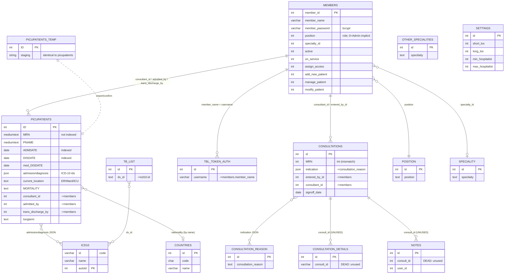

# CLAUDE.md — DMC Patient-Flow Hub (Internal Medicine)

> **Phase 1 deliverable: a complete mental model of this codebase.**
> This document describes the application *as it is* (not as it should be). It is the
> orientation map for the renovation work. Detailed findings live in
> [`REVIEW-FINDINGS.md`](REVIEW-FINDINGS.md); the remediation plan lives in
> [`RENOVATION-PLAN.md`](RENOVATION-PLAN.md).
>
> ⚠️ **This is a LIVE clinical system holding ~15,000 real patient records and ~323 user
> accounts.** It currently has systemic, internet-exploitable security defects
> (unauthenticated patient read/write/delete, SQL injection, trivial admin takeover,
> plaintext secrets). Treat every file as security-sensitive. See **§9 Security reality**.

---

## 1. What this application is

A hospital **patient-flow "hub"** for an Internal Medicine unit (the code and database use
legacy **`PICU`** identifiers throughout — treat `PICU`/`picupatients` as "the unit's
patients", not specifically a pediatric ICU). It is used to:

- **Admit** patients into the unit and capture demographics + admission diagnosis (ICD-10).
- **Assign** patients to consultants (manually or via an auto-balancing "shuffle").
- Track each patient's **flow/state** (active → medically-discharged → fully discharged;
  ward ↔ ICU; transfers; long-term; mortality).
- Manage **consultations** (referrals to/from other services, with sign-off).
- Produce **live dashboards/statistics** and **printable A4 reports** (KPIs, LOS,
  readmissions, mortality, per-consultant and per-specialty activity).
- Maintain a **registry / search** over historical admissions and consultations, with
  Excel/CSV export.

**Domain:** `dmc-im.com` ("DMC Internal Medicine"). **Stack:** PHP 8.3 (procedural) + MySQL
(MyISAM/InnoDB mix) + HTML/CSS/JS on the **AdminLTE 3** admin template. **No framework, no
package manager, no tests, no build step** for the app itself (vendored libraries only).

---

## 2. Project & file structure

Routing is **file-based**: each `.php` URL is an entry point. There is no router/front
controller. Pages render full HTML (via `sidebar.php` + `footer.php`); AJAX endpoints
return HTML fragments or JSON. The crucial structural fact:

> **Two tiers of files.** *Page* files `require 'sidebar.php'` (which starts the session,
> validates login, and defines the role arrays). *Action/AJAX* files in the subfolders
> mostly `require 'dbconnect.php'` **only** — so they have a DB handle but **no session and
> no authorization**. This split is the root of most security findings.

### Root — foundation / shared
| File | Role |
|---|---|
| `dbconnect.php` | Opens global `$mysqli`. **Hardcoded DB credentials.** Included by most action files. |
| `DBController.php` | OOP DB wrapper used by `Auth`. `runQuery/insert/update` = **prepared** (safe); `runBaseQuery` = raw. **Hardcoded DB credentials (duplicated).** |
| `Auth.php` | Member + remember-me token queries (prepared). |
| `Util.php` | CSPRNG token generator, `redirect()`, `clearAuthCookie()`. |
| `authCookieSessionValidate.php` | Sets `$isLoggedIn` from `$_SESSION['member_id']` or remember-me cookies. |
| `sidebar.php` | **The real auth gate for page files**: `session_start()` → validate → load `$user` → define `$access_PICU_*` role arrays → render AdminLTE sidebar. |
| `footer.php` | HTML footer (contains developer email addresses in plaintext). |
| `index.php` | Login (bcrypt `password_verify`; 3-month password expiry). |
| `logout.php` | `session_destroy()` + cookie clear (does **not** invalidate the DB token). |
| `register.php` | **Public self-registration** (position is client-supplied). |
| `change-password.php`, `forget-password.php`, `forget-password-email.php`, `reset-password.php`, `send-reset-pass-by-admin.php` | Password lifecycle (see §6.6). |
| `profile.php` | Self profile edit (IDOR on `member_id`). |
| `control.php` | **Admin control panel** (settings thresholds, specialties, consultation reasons, user/capability management). Proper page gate, but delegates writes to unguarded endpoints. |
| `dmc-users-update.php`, `dmc-users-delete.php` | **Unauthenticated** member update/delete (privilege escalation). |

### Root — clinical pages
| File | Role |
|---|---|
| `dashboard.php` | Landing page; fetches `dashboard/1.php` + `dashboard/3.php` via JS `fetch()` and **`eval()`s** their inline scripts. |
| `dmc-new-admissions.php` | New-admissions UI + inline assign handlers. |
| `dmc-patients.php` | **Main active-patient list**; hosts all flow modals; inline reverse-discharge + transfer handlers. |
| `active-list.php` | Read-only active board (opens in new tab). |
| `tb-patients.php`, `registry-tb-patients.php` | Active / historical TB patients (diagnosis ∈ `tb_list`). |
| `longterm.php` | Long-term patients list. |
| `dmc-new-consultation.php`, `48consultation.php` | Active consultations + recent (≤48h) consultation registry / undo sign-off. |
| `48discharge.php` | Recent (≤48h) discharges registry / undo discharge (Admin). |
| `dmc-old-patients.php`, `dmc-old-patients-details.php` | Bulk historical-patient import via `picupatients_temp` staging. |
| `search.php` | Registry search UI (Admin page). |
| `statistics.php`, `allstat.php` | Statistics dashboards (Admin pages). |
| `extract_data.php`, `export_patients.php`, `fetchicd10.php` | Excel export UI / export handler / ICD-10 typeahead. |
| `reset-testcount.php`, `test-trans.php` | **Leftover dev/test artifacts that write to live patient data with no auth — must be deleted.** |
| `errors.php` | Shared error-list partial (unescaped echo). |
| `400/401/403/404/413/500.shtml` | Static error pages. |

### Subdirectories
| Dir | Contents | Auth status |
|---|---|---|
| `newpatients/` | add, inline-update, **shuffle** (auto-assign), assign-to-primary, icu-transfer | mostly **no auth** |
| `patients/` | modify, discharge (+submit), complete-discharge (+submit), icu-discharge (+submit), change-consultant (+submit), transfer fragments, **delete** | mostly **no auth** |
| `consultations/` | add, modify, delete, details, specialty-dropdown | **no auth** (all) |
| `registry/` | search-results (admissions / diagnosis / consultations), patient-details, modify, Excel export | **no auth** (all) |
| `statistics/` | kpis, charts, charts1, time1, a4, a4-monthly | session-only or **no auth** |
| `dashboard/` | `1.php`, `3.php` (data fragments); `2.php`, `4.php` are empty | **no auth** |
| `vendor/` | jQuery 3.7.1, Bootstrap 5.3.3, AdminLTE, FontAwesome 6.5.2, Select2, Chart.js 4.4, moment.js, daterangepicker, html2canvas, **PHPMailer** _(PHPExcel was removed — Excel export now uses the bespoke root `xlsx-writer.php`)_ | third-party |
| `css/`, `dist/` | AdminLTE theme + custom `css/main.css`; FontAwesome icon set | assets |
| `work-orderes/` | AdminLTE build sources (unused at runtime; "orderes" is a typo) | dead weight |

### Files I could NOT fully account for — see §10 Open Questions
`48discharge.php`/`dmc-patients.php` "readmission" inline blocks; whether `dashboard/2.php`/`4.php` were ever used; the exact production value of the `members.active` column default.

---

## 3. Architecture & runtime

- **Procedural PHP**, server-rendered. A page = top-of-file PHP (auth + POST handling +
  queries) followed by an HTML body with embedded PHP echoes and a block of inline jQuery.
- **Two DB-access styles coexist:**
  1. `DBController` prepared statements (`Auth` + a handful of endpoints).
  2. Direct `$mysqli->query("… '$var' …")` / `mysqli_query()` with **string-interpolated
     `$_REQUEST`** — the dominant pattern, and the SQL-injection surface.
- **AJAX model:** pages POST to fragment endpoints with jQuery `$.post`; responses are
  injected via `innerHTML`. The dashboard additionally `eval()`s `<script>` text from
  fetched fragments ([dashboard.php:87](dashboard.php)).
- **Includes/dependencies (typical page):** `sidebar.php` → (`dbconnect.php` +
  `authCookieSessionValidate.php` → `Auth.php` → `DBController.php`, `Util.php`) … HTML …
  `footer.php`. Action endpoints typically include just `dbconnect.php`.
- **No autoloader, no namespaces, no composer.json** at the app root (only inside
  `vendor/PHPMailer`). Libraries are committed copies.

---

## 4. Data model

15 tables. **There are no foreign-key constraints anywhere** (most tables are MyISAM,
which cannot enforce them); all relationships are application-level conventions. Engines
and charsets are **mixed** (InnoDB & MyISAM; latin1, utf8mb3, utf8mb4), which is itself a
data-integrity/encoding risk. Row counts from `AUTO_INCREMENT`: `picupatients` ≈ **15,140**,
`consultations` ≈ 970, `members` ≈ 323, `icd10` ≈ 72,751 (reference), `tbl_token_auth` ≈ 798.

### Core tables (verified from `Demo.sql`)
- **`picupatients`** (MyISAM, PK `ID`) — the central patient/admission record. One row per
  admission *episode* (re-admission and ward↔ICU transfer create **new rows**). Key cols:
  `MRN` (mediumtext!), `PNAME`, `ADMDATE`, `DISDATE`, `med_DISDATE`, `ADMFROM`, `DISTO`,
  `MORTALITY` (status/outcome: 'Alive'/'Dead'/…), `admissiondiagnosis` (JSON array of ICD-10
  ids), `BED`, `nationality` (country *name* string), `gender`, `age`, `consultant_id`,
  `admitted_by`, `trans_discharge`, `trans_discharge_by`, `current_location` (ER/Ward/ICU),
  `newassign`, `assigned_on`, `delay`, `longterm`. **Indexes:** PK + `idx_..._admdate(ADMDATE)`
  + `idx_..._disdate(DISDATE)` only — **no index on `MRN`, `consultant_id`,
  `current_location`, `admitted_by`**.
- **`picupatients_temp`** (MyISAM, PK `ID`) — identical schema; **staging** for the
  old-patient import flow only.
- **`consultations`** (InnoDB, PK `id`) — `MRN` (**int** here vs mediumtext in picupatients —
  type mismatch), `PNAME`, `age`, `BED`, `consultation_date`, `consultation_from`,
  `current_location`, `entered_by_id`, `indication` (JSON of `consultation_reason` ids),
  `consultant_id`, `signoff_date`, `other_ind`, `consultation_to_service`.
- **`members`** (InnoDB latin1, PK `member_id`) — `member_name`, `member_password`
  (varchar(64); bcrypt), `member_email`, `position` (role; see §5), `active`, `pass_exp_date`,
  `full_name`, `on_service`, `specialty_id`, and capability flags `assign_access`,
  `add_new_patient`, `manage_patient`, `modify_patient`.
- **`tbl_token_auth`** (InnoDB, PK `id`) — remember-me tokens; `username` links to
  `members.member_name` (by name, not id), `password_hash`, `selector_hash`, `is_expired`,
  `expiry_date`.

### Reference / config tables
- **`icd10`** (MyISAM) — `id` (code), `name`; 72k ICD-10 diagnoses.
- **`tb_list`** — `dx_id` (ICD-10 codes that classify a patient as TB).
- **`position`** — roles **2=Registrar, 3=Consultant, 4=Resident, 5=Observer**.
  **`0`=Admin is implicit and NOT in this table.**
- **`speciality`** and **`other_specialities`** — two overlapping specialty lists
  (column misspelled `specilaity` in both). Duplication.
- **`consultation_reason`** — indication options (referenced by `consultations.indication`).
- **`settings`** (single row, id=0) — operational thresholds: `min_hospitalist`(6),
  `max_hospitalist`(30), `min_subs`(7), `max_subs`(5), `short_los`(5), `long_los`(11).
  [NEEDS CLINICAL REVIEW]
- **`countries`** — nationality reference (`code`, `name`).

### Dead schema (exist but **no code reads/writes them**)
- **`consultation_details`** (`consult_id` varchar, `daily_check`, `priority_consult`, `date`)
- **`Notes`** (`consult_id`, `note`, `user_id`, `user_position`)

These appear to be planned-but-unbuilt (or removed) features.

### ER diagram (logical relationships — none are enforced FKs)



---

## 5. Roles, authorization & sessions

### Identity & session
- Login (`index.php`): prepared lookup by `member_name`, `password_verify` against bcrypt.
  On success sets `$_SESSION['member_id'|'position'|'name']`. Password older than
  `pass_exp_date + 3 months` → forced to `change-password.php`.
- "Remember me": 16/32-char CSPRNG tokens, **bcrypt-hashed** in `tbl_token_auth`; plaintext
  in cookies (`member_login`, `random_password`, `random_selector`), 30-day expiry.
- `authCookieSessionValidate.php` validates session-or-cookie and sets `$isLoggedIn`.

### Role model (`members.position`)
`0`=Admin (implicit), `2`=Registrar, `3`=Consultant, `4`=Resident, `5`=Observer. Page-level
gates use arrays defined in `sidebar.php`:
- `$access_PICU_patients = [0,2,3,4]` (clinical pages; excludes Observer)
- `$access_PICU_endorsement = [0,2,4]` ("All" vs "My" view; note Consultant=3 sees only "My")
- `$access_PICU_control = [0]` (Admin-only: registry, statistics, control, old-patients)
- Plus per-user **capability flags**: `assign_access`=Can Assign, `add_new_patient`=Can Add,
  `manage_patient`=Can Manage, `modify_patient`=Can Modify.

### Intended permission matrix (from `permissions.docx`) — ⚠️ treat as DATED
> Per the maintainer, `permissions.docx` is likely **out of date** — do **not** treat this matrix
> as ground truth; the intended role/capability model must be **re-confirmed** with the
> team/clinicians. This caveat affects only the *fine-grained* "which role may do X" mapping; the
> **Critical** findings below (endpoints with *no* authorization at all, SQLi, admin takeover) are
> wrong under **any** policy and stand regardless.
| Area | Action | Intended |
|---|---|---|
| New admissions | delete | Admin only |
| | add new / from ICU | Can Add |
| | assign / assign-to-primary | Can Assign |
| | assign to me | any consultant |
| Patient list | modify | Can Modify |
| | transfer / discharge | primary consultant **or** Can Manage |
| | label long-term | anyone |
| Registry | access; same-day discharge reversal | Admin only |
| Consultations | access | consultants + registrars |
| | add | + residents |
| | sign off | primary consultant **or** Can Manage |
| | delete | Admin only |
| Consultation registry | access; same-day signoff reversal | Admin only |

### How it is ACTUALLY enforced (the gap)
- **Page files**: enforce `position` server-side (good) — *but several run their POST/
  action handlers **before** the role check* (e.g. [dmc-patients.php:3](dmc-patients.php),
  [dmc-old-patients.php:4](dmc-old-patients.php), [search.php:27](search.php)), so those
  actions bypass the gate.
- **Per-action enforcement (ownership / "primary consultant only" / capability)** is almost
  entirely **UI-only** — the buttons are hidden, but the underlying endpoints don't check.
- **Action/AJAX endpoints**: the overwhelming majority have **NO auth check at all**
  (`require 'dbconnect.php'` only). Confirmed examples: `patients/dmc-patient-delete.php`,
  all of `patients/*-submit.php`, `patients/dmc-patients-modify.php`, all of
  `consultations/*`, all of `registry/*`, `dmc-users-update.php`, `dmc-users-delete.php`,
  `newpatients/dmc-patients-add.php`, `export_patients.php`, `fetchicd10.php`,
  `reset-testcount.php`, `test-trans.php`, `statistics/*` (session-only or none),
  `dashboard/1.php` & `3.php`.

**Net effect:** authorization is effectively cosmetic. See §9.

---

## 6. Core flows (step by step)

### 6.1 Admission
1. User opens `dmc-new-admissions.php` (page-gated to `$access_PICU_patients`; "New
   Admission" button shown if `add_new_patient=1`).
2. Modal collects bed, MRN, name, age, gender, nationality, admit date, admit-from,
   ICD-10 diagnosis (Select2 → `fetchicd10.php`). Client-side checks non-empty only.
3. `$.post` → `newpatients/dmc-patients-add.php` (**no auth**): duplicate-MRN check
   (`MRN=… AND DISDATE IS NULL`), then **string-interpolated INSERT** into `picupatients`.
   `admitted_by` is taken from the POST body (spoofable), not the session.
4. New row has `consultant_id = NULL` → enters the **unassigned queue**
   (`DISDATE IS NULL AND consultant_id IS NULL`).
5. Inline field edits on the page → `newpatients/dmc-new-patients-update.php` (**no auth**)
   on every change event. `picupatients_temp` is **not** used here (only by old-patient import).

### 6.2 Assignment (3 paths)
- **Auto "shuffle"** (`newpatients/dmc-patients-shuffle.php`): a 4-round balancing algorithm
  driven by `settings` (min/max hospitalist & subs) and `members.on_service`/`specialty_id`.
  Assignment UPDATEs use `… WHERE consultant_id IS NULL LIMIT 1` with **no specific patient
  id** → nondeterministic, **race-prone** under concurrency. Login redirect lacks `exit()`,
  and the capability check is commented out → effectively runnable by anyone. Emits
  `var_dump` debug to the browser.
- **Assign to primary** (`newpatients/dmc-assign-to-primary.php` → handler in
  `dmc-new-admissions.php`): manual; note a broken HTML quote in the fragment currently
  corrupts the submitted patient id.
- **Assign to me** (handler in `dmc-new-admissions.php`): self-assign; `userid` from POST.

### 6.3 Patient-flow state machine (`picupatients`)
States are derived from field combinations (no explicit status column):

| State | Condition |
|---|---|
| Active (Ward/ER) | `DISDATE IS NULL`, `med_DISDATE IS NULL`, `current_location≠ICU` |
| Active ICU | `DISDATE IS NULL`, `current_location='ICU'` |
| Medically discharged / still in (phase-1) | `DISDATE IS NULL`, `med_DISDATE` set, `delay` set |
| Long-term | `longterm='longterm'` (cross-cutting) |
| TB | diagnosis ∈ `tb_list` (cross-cutting) |
| Discharged from ward | `DISDATE` set, `trans_discharge='discharge from ward'` |
| Discharged from ICU | `DISDATE` set, `trans_discharge='discharge from ICU'` |
| Transferred out | `DISDATE` set, `trans_discharge IN ('other transfer','transfer to other speciality')`; a **new row** is created for the receiving location/consultant |

Transitions (all via **unauthenticated** `patients/*` endpoints): discharge (two-phase:
medical → complete), ICU discharge (single-step), transfer (ward↔ICU / to specialty — creates
a new row, **not atomic**, no transaction), reverse-discharge (clears `DISDATE/med_DISDATE/
delay`), change-consultant (bulk), modify, delete (hard). `MORTALITY` is set on discharge
('Alive'/'Dead'/LAMA/etc.). Audit attribution (`trans_discharge_by`, etc.) comes from
client-supplied `userid` → **spoofable / unreliable**.

### 6.4 Consultations lifecycle
Create (`consultations/dmc-consultation-add.php`, no auth) → view active
(`signoff_date IS NULL`; a role filter exists but is **dead code**
[dmc-new-consultation.php:89](dmc-new-consultation.php), so everyone sees all) → modify
(prepared, but no ownership check) → **sign off** (`signoff_date=CURDATE()` via
string-interpolated handler; no ownership check) → admin registry `48consultation.php`
(undo same-day signoff) → delete (`consultations/dmc-consultation-delete.php`, no auth).
`consultation_details`/`Notes` are **not implemented**.

### 6.5 Live statistics & dashboards
- **Dashboard** (`dashboard.php`): on load, JS `fetch()`es `dashboard/1.php` then
  `dashboard/3.php`, injects HTML, and `eval()`s their inline scripts to render Chart.js
  charts. **Refresh = full page reload only** (no polling/websockets).
- **dashboard/1.php**: 30-day admissions/discharges (31× full-scan prepared loop), current
  census, per-consultant last-day activity, consultations — **no auth**.
- **dashboard/3.php**: top diagnoses (JSON_CONTAINS join), YTD counts, avg LOS, capacity
  utilization (`active / (hospitalist_n × max_hospitalist) × 100`), per-consultant counts
  (PHP-side aggregation + **N+1** name lookups) — **no auth**.
- **statistics.php / allstat.php** (Admin pages) drive AJAX endpoints `statistics/kpis.php`,
  `charts.php`, `charts1.php`, `time1.php` for KPI/per-physician charts. These compute
  admissions, discharges, transfers-to-ICU, ICU/ward mortality, consultations, sign-offs,
  LOS, and 72-hour readmissions. Heavy **N+1** and date-function-wrapped (index-defeating)
  queries; several **cross-year aggregation bugs**; readmission window logic is suspect
  [NEEDS CLINICAL REVIEW].

### 6.6 Password lifecycle (security-critical)
- **Register** (`register.php`, public): bcrypt-hashes password (good), but `position` is
  taken from POST with no server-side validation → `position=0` ⇒ **self-register as Admin**.
- **Change** (`change-password.php`): verifies old password, bcrypts new; UPDATE is
  string-built (session-sourced id).
- **Forgot / admin-reset**: emails a link whose token is `md5(member_email)` +
  **`md5(member_password-bcrypt-hash)`** — **deterministic, non-expiring, not single-use**.
- **Reset** (`reset-password.php`): validates token via
  `… where md5(member_email)='$email' and md5(member_password)='$pass'` — **string-built from
  `$_GET` ⇒ SQL injection**; the UPDATE is likewise string-built.

### 6.7 Printed A4 reports
`statistics/a4.php` (yearly) and `statistics/a4-monthly.php` (per-month) render multi-page
`<page>`-element HTML sized for **A4 landscape** via `@page`/print CSS, with Chart.js charts.
**Output is browser print, not server-side PDF.** Both run **without authentication** and
issue ~1,800 / ~3,500+ queries per load (12-month loops with per-day census + N+1
readmission sub-queries). One report page is `display:none` and never prints.

---

## 7. Configuration, secrets, environment

- **DB credentials hardcoded** in `dbconnect.php` **and** `DBController.php` (duplicated):
  host `localhost`, a real-looking user/password, db name. **Rotate immediately.**
- **SMTP credentials hardcoded** in `forget-password-email.php` and
  `send-reset-pass-by-admin.php` (`info@dmc-im.com` / a plaintext password). **Rotate.**
- `.htaccess`: PHP 8.3 handler; **force-redirects `dmc-im.com` → `http://www.dmc-im.com`
  (plain HTTP, not HTTPS)**; long static-asset cache. `php.ini`: only `mysqli.max_links=200`.
- **Committed runtime artifacts:** `php_errorlog` (322 KB; 1,566 error/SQL/PHI-pattern hits)
  and `consultations/php_errorlog`. `permissions.docx` (the spec). `Demo.sql` (512 KB dump
  **containing real PHI** — do not redistribute).
- Branding references `innovia.ai` / `healthpro.Ai` (white-label origin).
- **Third-party libraries** (vendored, unmanaged): jQuery 3.7.1, Bootstrap 5.3.3, AdminLTE,
  FontAwesome 6.5.2, Select2, Chart.js 4.4, moment.js, daterangepicker, html2canvas,
  PHPMailer (current-ish). _(PHPExcel was **removed** — the Excel export in `registry/export-results-exel.php`
  now uses the bespoke, dependency-free root `xlsx-writer.php`; no Composer/PhpSpreadsheet needed.)_
- **No `.env`, no config separation, no secrets manager, no `.gitignore`, no CI, no tests.**

### Run/deploy (observed)
Apache + mod_php (PHP 8.3), MySQL, on shared hosting
(`/home/customer/www/dmc-im.com/public_html/`). To run locally: import `Demo.sql` into MySQL,
point `dbconnect.php`/`DBController.php` at it, serve the folder with PHP 8.3, browse
`index.php`.

---

## 8. Conventions & gotchas for anyone editing this code

- Patient identity in the UI is the row **`ID`**; clinicians think in **`MRN`** (which is
  un-indexed and inconsistently typed). A re-admission/transfer is a **new row**, so a
  patient = *many* `picupatients` rows over time.
- "Active" has **multiple definitions** across files (sometimes just `DISDATE IS NULL`,
  sometimes also excluding ICU/long-term/TB/medically-discharged). Confirm the intended
  definition before changing any count.
- Audit fields (`admitted_by`, `trans_discharge_by`, `entered_by_id`, `user_id`) are written
  from **client-supplied** values — do not trust them as a record of who did what.
- Many endpoints emit `var_dump`/debug output; the dashboard `eval()`s fetched scripts.
- `specilaity` is the (consistent) misspelling of "speciality" in two tables.

---

## 9. Security reality (read before touching anything)

This system, as configured, is **exploitable by an unauthenticated attacker over the
internet**. The dominant, *systemic* issues (full detail + line numbers in
`REVIEW-FINDINGS.md`):

1. **Broken access control** — most action endpoints have no auth; patient PHI can be read,
   modified, and **deleted** without logging in (e.g. `patients/dmc-patient-delete.php`,
   `registry/dmc-search-patients-modify.php`, `reset-testcount.php`).
2. **Trivial privilege escalation** — `dmc-users-update.php` (unauth) sets any account's
   `position=0`; `register.php` accepts `position=0`. Either ⇒ full Admin.
3. **SQL injection** — pervasive string-interpolated `$_REQUEST` in queries across
   `patients/`, `newpatients/`, `consultations/`, `registry/`, `statistics/`, auth/reset flows.
4. **XSS** — patient data echoed without escaping throughout search/registry/modal views.
5. **No HTTPS** (`.htaccess` forces HTTP); **plaintext DB & SMTP secrets** in code.
6. **Broken password reset** (md5-of-hash token, SQL-injectable).
7. **No CSRF protection**, **no audit trail**, **no transactions** on multi-step writes.
8. **Dev artifacts in prod** that destroy/modify live data (`reset-testcount.php`,
   `test-trans.php`) and a **committed error log** leaking internals.

---

## 10. Open questions (could not determine from the code/dump alone)

- **DB default of `members.active`** — does self-registration create an *active* account
  immediately? (Determines whether the `register.php` admin-escalation is self-contained.)
- **Is the app actually internet-facing**, or only on a hospital intranet/VPN? (Changes the
  exploitability blast radius, not the defects themselves.)
- **Backups & DR**: is there any DB backup/retention process? None is in the repo.
- **Clinical correctness** [NEEDS CLINICAL REVIEW]: meaning/intended use of `settings`
  thresholds (`short_los`/`long_los`/`min_*`/`max_*`); the "72-hour readmission" window
  (code uses a 30-day lookback); LOS computed via `strtotime/86400` (DST drift); the
  shuffle auto-assignment policy; `MORTALITY` value vocabulary; the two-phase
  (medical vs complete) discharge semantics.
- **Were `consultation_details`/`Notes`, `dashboard/2.php`/`4.php` ever live?** They exist
  but are unused now.
- **Intended environments** (dev/staging/prod separation) — none is evident.
- **Who operates/maintains it now** (the white-label vendor vs the hospital)?
```
