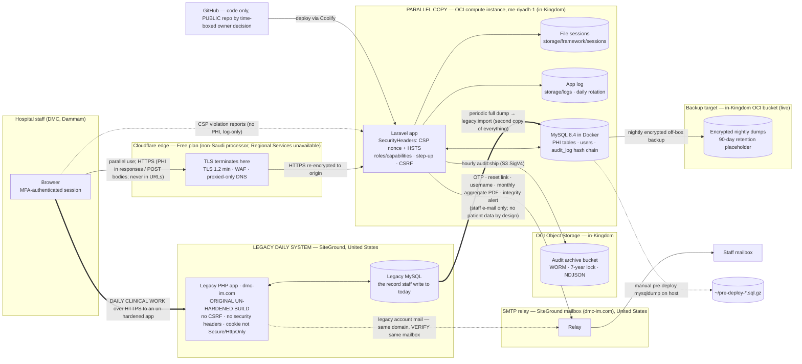

# Data Protection Impact Assessment (DPIA) — DMC Internal Medicine patient-flow hub

> **Confirmed inputs (2026-09-03) — see [`CONFIRMED-FACTS.md`](CONFIRMED-FACTS.md).** Controller: **Dammam Medical Complex**, under the **Eastern Health Cluster** (Saudi Health Holding Company); public-sector ownership, exact registering entity for counsel to confirm. Primary processor: **the developer/operator company** (holds the code, the OCI tenancy and the domain) — **no controller–processor contract exists yet (top action)**. DPO **not yet appointed** (treated as mandatory). The daily production system is still the **legacy PHP app on `dmc-im.com` (SiteGround, United States), original un-hardened build**; the Laravel app runs in parallel until cutover. Review: annual (next 2027-09-03), owner interim until a DPO is named. Legal citations are **[PROPOSED]** — see [`PROPOSED-CITATIONS.md`](PROPOSED-CITATIONS.md).

> **DRAFT — for review by the hospital's legal / data-protection officer and clinical governance; not legal advice.**
>
> Version 0.1 · 2026-09-03 · Assessed processing: **both** systems that hold the unit's data — the
> legacy PHP app on `dmc-im.com` (SiteGround, United States), which is the daily system, and
> `laravel/` on `main`, deployed on one OCI instance in me-riyadh-1 and running in parallel.
> Assessment owner: [PLACEHOLDER — DPO]. Technical contributor: [PLACEHOLDER]. Clinical contributor: [PLACEHOLDER].

---

## 1. Why this assessment exists

The hub processes **health data of in-patients** — diagnoses, outcomes including death,
resuscitation status, free-text clinical narratives — together with staff identity data. Health
data is a sensitive category under the Kingdom's Personal Data Protection Law, and the Implementing
Regulations require the controller to assess the privacy impact of processing that involves
sensitive data, new technology, or a likely high risk to data subjects
[VERIFY ARTICLE — the impact-assessment duty and its triggers; whether prior consultation with the
competent authority is required when residual risk stays high].

This document records that assessment. It is written against the systems **as they are** — both of
them, because the processing runs on two today (§2.1) — using
[`ROPA.md`](ROPA.md) as the inventory, [`../DATABASE-AND-BEHAVIOR.md`](../DATABASE-AND-BEHAVIOR.md)
and [`../HANDOVER-COMPLIANCE.md`](../HANDOVER-COMPLIANCE.md) as the behavioural ground truth, and
[`../DEPLOY-LARAVEL.md`](../DEPLOY-LARAVEL.md) for the operating environment. Where a control is
"planned" it is labelled **GAP** and given an owner and a date placeholder.

---

## 2. Description of the processing

### 2.1 Nature

**Two systems are in scope, not one.** The unit's patient-flow processing runs today on the **legacy
PHP application at `dmc-im.com`, hosted on SiteGround in the United States**, in its **original
un-hardened build**; the **Laravel application on OCI Riyadh** runs **in parallel** with a full copy
of the same data and is the source of truth only for the consultation ledger (CONFIRMED-FACTS
B1–B3). Both are operated by the **operator company** as processor for **DMC** as controller, with
**no controller–processor contract in place** (A5).

This matters for every judgement below: **the controls described in the risk register are Laravel
controls, and they mitigate only the parallel copy until cutover.** The system staff actually work
in has none of them.

The Laravel application (Laravel 13, Inertia/Vue 3, MySQL 8.4) is used to: admit and track patients
through ward/ICU/discharge (A1 in the ROPA), keep a ledger of specialist consultations (A2 — the one
activity it owns), write and acknowledge handover notes (A3 — a module with no legacy equivalent),
produce dashboards, statistics, exports and a monthly PDF (A4), manage staff accounts with mandatory
MFA (A5), maintain a tamper-evident audit log shipped off-box (A6), back up the database (A7 — live,
nightly, encrypted, off-box, in-Kingdom), send transactional e-mail (A8), and hold the parallel
migration copy itself (A10).

### 2.2 Scope (volumes, from the live database)

| Population | Approximate size |
|---|---|
| Distinct patients (`patients`) | 17,400 |
| Admission episodes (`admissions`) | 37,700 |
| Consultations | 1,300 (≈1,283 historical rows at the ledger migration) |
| Staff accounts (`users`) | 331 (≈150 active) |
| Handover revisions, follow-ups, signatures, notifications | Growing daily; append-only |
| **Complete copies of that dataset in existence** | **Two** — the legacy daily database (SiteGround, US) and the Laravel parallel copy (OCI Riyadh) — plus backups and uninventoried migration dumps (R15) |

### 2.3 Context

- The hub is a **supplementary part of the medical record** (CONFIRMED-FACTS C1) and a **secondary**
  clinical system: it does not replace the hospital's primary record system [VERIFY name; clinical
  governance to minute the supplementary-record status].
- Users are hospital employees on the unit; the Observer role exists for read-only viewers.
- Patients are not users of the system and are not currently informed of it by a system-specific
  notice (a privacy notice exists in the Laravel app at `/privacy`; the legacy daily site carries
  none).
- **The Laravel application has not replaced the legacy PHP system — it runs beside it.** The legacy
  app is still the daily system, and the build that is live on `dmc-im.com` is the **original,
  un-hardened** one, not the hardened `renovation` build, which was never deployed there (verified
  read-only 2026-09-03). Its documented systemic defects — unauthenticated patient read, write and
  delete, SQL injection, admin self-registration, plaintext secrets, no CSRF token, no security
  headers, a session cookie without `Secure`/`HttpOnly` — are **live over real PHI on a US host**,
  and an external header/TLS assessment on the same date graded it **F** against the Laravel app's
  **A**. Cutover is intended to replace the dmc-im.com code with the Laravel app (D2); until it
  happens, both the legacy data and its exposure history remain live, and the legacy data is
  imported into the parallel copy on each refresh.
- The hospital does not operate either system. The operator company holds the code, the hosting, the
  domain and full data access; DMC's only lever over any of the controls below is an instruction it
  has not yet put in a contract.

### 2.4 Purposes

Operational patient-flow management; continuity of care at handover; specialist-referral
bookkeeping; service statistics and management reporting; staff authentication; accountability.

### 2.5 Data flows

Points to note on the diagram:

1. **The thick path is the live one.** Daily clinical work goes to the legacy app in the United
   States, over a build with no CSRF token, no security headers and no session-cookie flags. Every
   in-Kingdom control on the right-hand side of the diagram protects the copy, not the record.
2. **The dataset exists twice.** `legacy:import` re-creates a complete second copy of ~17k patients
   and ~37k episodes in the Kingdom while the first copy keeps being written to abroad (ROPA A10).
3. **Cloudflare sees clear-text PHI.** TLS terminates at the Cloudflare edge and is re-established
   to the origin. Cloudflare is a non-Saudi legal entity, the plan is **Free**, and Regional
   Services — the option that would confine TLS termination in-Kingdom — is Enterprise-only
   [PROPOSED]. Whether edge decryption is a "transfer outside the Kingdom" is an open legal question
   [VERIFY ARTICLE — transfer definition].
4. **The e-mail path leaves the Kingdom** — it is the `dmc-im.com` mailbox on SiteGround in the
   United States, the same provider that hosts the legacy daily system — but carries only staff
   personal data and aggregate reports by design; the monthly template was inspected and carries no
   MRN or name (CONFIRMED-FACTS C6).
5. **Audit shipping and backups stay in-Kingdom** and land on immutable (audit) and encrypted
   (backup) storage. Neither exists for the legacy daily system, whose only backups are whatever
   SiteGround takes, in the United States [VERIFY].

---

## 3. Necessity and proportionality

| Question | Assessment | Action |
|---|---|---|
| Is each data element necessary for the purpose? | Demographics are minimal (age, not date of birth; nationality as a country name). Diagnoses (ICD-10) are needed for TB classification, LOS and case-mix. Free-text fields (`handovers.body`, `consultations.response_note`, `consultation_followups.note`) are open-ended by nature. | Clinical guidance on what belongs in free text, and what should stay in the primary record [PLACEHOLDER — governance instruction]. Confirm `nationality` is still needed for reporting [VERIFY]. |
| Purpose limitation | Purposes are operational and internal; statistics are a compatible further use [VERIFY]. No marketing, profiling or automated decision-making about patients. The shuffle auto-assigns *consultants* (workload balancing), not patients' care. | Record the auto-assignment as staff workload processing in the ROPA (done, A1). |
| Accuracy | Attribution is session-sourced; multi-row writes are transactional; data-quality digest runs daily. **Worked example of an accuracy failure — the UTC-vs-Riyadh day bug (§5, R2).** | Keep `app_timezone` set to the hospital's zone at runtime; keep the DB container's zone aligned [VERIFY]. |
| Storage limitation | No retention period is defined for clinical rows; nothing is ever purged — **in either system**, and the legacy copy has no destruction mechanism at all. | DATA-RETENTION.md §2.0–§2.3; legal confirmation of the clinical period [NEEDS LEGAL CONFIRMATION]. |
| **Duplication** | The same dataset is held twice, in two jurisdictions, under two different control regimes, for the duration of the parallel period (ROPA A10). The duplicate serves migration, not a new purpose, but it doubles the exposed surface and every retention obligation. | Shorten the parallel window; fix a cutover date; destroy the legacy copy and the migration dumps with a certificate [PLACEHOLDER — owner + DPO]. |
| Transparency | A privacy notice is served by the Laravel app at `/privacy`; the legacy daily site — the one staff and the record actually live on — carries none. Staff are informed by [PLACEHOLDER — HR/IT policy]. | Publish the notice where patients and staff can actually reach it [PLACEHOLDER]. |
| Data-subject rights | Fulfilled indirectly via the medical-records office, and only fully if **both** copies are searched (ROPA §5). | Procedure covering both systems [PLACEHOLDER]. |
| Processors | **Primary processor: the operator company — no controller–processor contract exists (top action).** Sub-processors: SiteGround (legacy hosting + relay, US), OCI (Riyadh), Cloudflare (Free). No DPAs on file for any of them. | Art. 17 contract first [PROPOSED], then the sub-processor DPAs — DPA-AND-TRANSFERS.md A0 [PLACEHOLDER — owner/date]. |
| International transfers | **The whole daily clinical dataset is hosted in the United States** (SiteGround); plus the US SMTP relay and the Cloudflare edge for the parallel copy. | Legal analysis + safeguards [VERIFY]; the fastest structural mitigation is cutover, which removes the largest transfer entirely. |
| Less intrusive alternatives considered | Aggregate-only e-mails; PHI-free URLs; break-glass logging available; Observer role read-only. | Consider an in-Kingdom relay and Cloudflare regional services (§7); above all, complete cutover so the record stops living on an un-hardened US host. |

---

## 4. Risk-scoring method

Likelihood (L) and severity to data subjects (S) are each scored one to five; the score is L × S.

| L | Meaning | S | Meaning for the data subject |
|---|---|---|---|
| 1 | Remote — would require several independent failures | 1 | Negligible — no real effect |
| 2 | Unlikely — a determined insider or a rare fault | 2 | Minor — inconvenience, easily reversed |
| 3 | Possible — plausible within a year | 3 | Moderate — distress, some loss of control, recoverable |
| 4 | Likely — expected within a year without further action | 4 | Major — discrimination, stigma (e.g. TB, DNR status), lasting loss of control |
| 5 | Almost certain / already happening | 5 | Severe — physical harm from wrong clinical information, or mass exposure |

Bands: **Low** 1–5 · **Medium** 6–11 · **High** 12–19 · **Critical** 20–25. Residual risk at
High or Critical after planned measures triggers escalation to the DPO and consideration of prior
consultation with the competent authority [VERIFY].

---

## 5. Risk register

Each entry gives the inherent score (no controls), the controls that exist in code today, the
residual score with those controls, and the planned measures with owner and date placeholders.

**Read this first — which system each risk is about.** R1–R12 were written about the **Laravel
application**, and every control they credit is a Laravel control. Because the Laravel app is not
yet the daily system, **those controls mitigate the parallel copy only; they will apply to the
unit's actual record only once cutover happens.** The risks that describe the live picture today are
**R13 (the un-hardened legacy daily build over real PHI)**, **R14 (that record being hosted in the
United States without a safeguard)** and **R15 (the duplicate dataset the parallel period creates)** —
R13 and R14 are the highest-rated risks in this assessment, and neither is reduced by anything in
R1–R12. Where a legacy-side counterpart of an R1–R12 risk exists, the entry says so.

### R1 — Confidentiality breach by an external attacker

| | |
|---|---|
| **Scope** | **Laravel parallel copy.** The same scenario against the legacy daily system is R13, where it scores far worse and none of the controls below exist. |
| **Scenario** | Exploitation of the web application, the host, or a stolen credential leads to bulk read of `patients`, `admissions`, `admission_diagnoses`, `handovers`, `consultations`. Roughly 17,400 people's diagnoses and outcomes. |
| **Inherent** | L4 × S5 = **20 Critical** (the same data is simultaneously exposed through the un-hardened legacy build — R13 — so an attacker has a second, easier route to it). |
| **Existing controls** | Mandatory TOTP MFA for every user (`EnsureMfaEnrolled`); phased registration with e-mail and authenticator proof before an account exists; admin activation of new accounts; IP-keyed login/MFA throttling; failed-login burst alert to admins; server-side role/capability checks on every endpoint; step-up re-auth on destructive/config actions; CSRF; CSP with per-request nonce + HSTS (`SecurityHeaders`); TLS 1.2 minimum at the edge; origin reachable only through Cloudflare [VERIFY]; PHI never in URLs (no leakage via logs/referrers); session idle timeout thirty minutes and lifetime two hours; secrets (`mfa_secret`, `mail_password`) encrypted with `APP_KEY`; single-instance, single-region footprint. |
| **Residual** | L2 × S5 = **10 Medium**. Severity cannot be reduced by controls; likelihood is. |
| **Planned** | Extend encryption at rest beyond the four narrative columns — today everything else relies on the cloud provider's default volume encryption, which reduces the impact of volume/backup theft but not of application-layer compromise [PLACEHOLDER — owner, date]; periodic external penetration test [PLACEHOLDER — owner, date]; vulnerability management for Composer/npm dependencies [PLACEHOLDER]; WAF rules tuned [PLACEHOLDER]. **Cutover is also a mitigation here**: it removes the second, unauthenticated route to the same data (R13). |

### R2 — Integrity / accuracy: wrong clinical facts recorded (worked example: the UTC-vs-Riyadh day bug)

| | |
|---|---|
| **Scenario** | A systematic fault causes records to state something false about a patient. **Worked example — just fixed:** `config/app.php` defaults the application timezone to UTC when `APP_TIMEZONE` is not set. The live instance ran on UTC while the unit works in Riyadh time (three hours ahead). Every date-only column stamped with "today" — `admissions.admit_date`, `medical_discharge_date`, `discharge_date`, `assigned_on`, `consultations.signoff_date`, `consultation_followups.followup_date`, and the `handovers.updated_at` same-day gate — was written with the *previous* calendar day for actions taken between midnight and three in the morning Riyadh time. Consequences: a discharge recorded on the wrong day (length-of-stay off by one), "discharged today" and readmission-window metrics mis-counted, a handover written after midnight not counting as "refreshed today" so an unnecessary incomplete-handover reminder was raised, and follow-up ticks landing on the wrong day. A related code defect had the consultation-dashboard ageing computed from the database host's clock rather than the application's day (fixed in commit `f0b2962`, "dashboard ageing uses the app's day, not the DB host's"). The runtime fix is to set the timezone in Control → System (`RuntimeConfigServiceProvider` applies `settings.app_timezone` to `config('app.timezone')` and `date_default_timezone_set` on boot) or `APP_TIMEZONE` in `.env`, and to align the MySQL container's zone [VERIFY the exact production change and date; VERIFY whether historical rows in the affected window were corrected]. |
| **Inherent** | L5 × S3 = **15 High** (it was actually happening). |
| **Existing controls** | Runtime timezone override with in-app history (`setting_changes`); DEPLOY-LARAVEL.md §2 warning; daily data-quality digest (`dq:notify`); check constraints on inverted dates (`2026_06_14_010006`); transactional multi-row writes; session-sourced attribution (no spoofed actors); append-only revisions so corrections never destroy history; reverse-discharge / reverse-sign-off limited to same-day and audited. |
| **Residual** | L2 × S3 = **6 Medium**. |
| **Planned** | Add a startup/health assertion that the effective timezone equals the configured hospital zone and that `NOW()` in MySQL agrees with PHP within a tolerance [PLACEHOLDER — owner, date]; include "date-of-record vs date-of-entry" in clinical-audit spot checks [PLACEHOLDER]; surface it on the `/health` endpoint. |

### R3 — Availability and loss of the record

| | |
|---|---|
| **Scope** | **Both systems, asymmetrically.** The Laravel copy is backed up; the daily record on SiteGround is not backed up by anyone the processor can point to. |
| **Scenario** | Disk failure, ransomware, a destructive migration, or an operator error destroys a database. For the **Laravel copy** this now means losing a copy that can be restored. For the **legacy daily database** — the operative record — it means losing the unit's live census and 37,700 historical episodes, with recovery depending entirely on whatever SiteGround happens to retain; care coordination reverts to paper. |
| **Inherent** | L3 × S4 = **12 High** (single instance per system, no controller-side copy). |
| **Existing controls** | **Laravel side:** nightly encrypted off-box dump to the in-Kingdom bucket `dmc-db-backups`, encrypted local copies, a daily `backup:verify` staleness alert and a proven restore drill (BACKUP-AND-RESTORE.md); manual dump before every deploy and before `legacy:import`; migrations are additive; the audit log has an off-box immutable copy; soft deletes make most "deletions" reversible. **Legacy side:** none that has been verified — provider backups of unknown scope, retention and restorability [VERIFY]. |
| **Residual (today)** | Laravel copy: L1 × S4 = **4 Low**. Legacy daily record: L3 × S4 = **12 High** — the backup work never reached it. Carried at **12 High** because the operative record is the unprotected one. |
| **Planned** | Establish, test and document a backup and restore path for the **legacy daily database** for as long as it remains the record, or shorten that period by cutting over [PLACEHOLDER — owner, date]; obtain SiteGround's backup terms in writing [VERIFY]; keep the twice-yearly restore drill (INCIDENT-RESPONSE.md §11); decide whether the controller should hold an escrowed copy [PLACEHOLDER — DPO]. Expected residual after cutover: L1 × S4 = 4 Low. |

### R4 — Unauthorised access via a legitimate account

| | |
|---|---|
| **Scope** | **Laravel parallel copy.** Staff hold a **second, separate account** in the legacy daily system, which has none of the controls below — the original build allows admin self-registration and there is no joiner/leaver process spanning both systems (ROPA A5). |
| **Scenario** | Credential phishing, a shared workstation left logged in, a trusted-device cookie on a lost laptop, or an over-privileged role lets someone read or change records they should not. |
| **Inherent** | L4 × S4 = **16 High**. |
| **Existing controls** | MFA cannot be self-disabled; recovery codes hashed; trusted-device skip is a fixed, non-extending window (default twenty-four hours, admin-tunable, revocable, audited as `mfa.device_trusted` / `mfa.device_revoked`); idle timeout thirty minutes, absolute timeout configurable; password expiry three months; remember-me never granted to MFA users; capability flags per user; primary-consultant ownership checks; admin-only registry/exports; every action audited with IP; failed-login burst alert. |
| **Residual** | L2 × S4 = **8 Medium**. |
| **Planned** | Quarterly access review of roles and capability flags in Control → Users [PLACEHOLDER]; decide whether `mfa_trusted_device_hours` should be shortened or zeroed on shared workstations [PLACEHOLDER — governance]; enable `log_record_opens` by default or for defined sensitive episodes [PLACEHOLDER]. |

### R5 — Cross-border exposure at the Cloudflare edge

| | |
|---|---|
| **Scope** | **Laravel parallel copy only** — the legacy daily site is served from SiteGround and shows none of this edge's protections (its apex redirects to plain HTTP, and it has no HSTS), so it appears not to sit behind this Cloudflare account [VERIFY]; its far larger exposure is R14. |
| **Scenario** | Cloudflare terminates TLS; the edge handles every PHI-bearing response and POST in clear text. A lawful-access request in a foreign jurisdiction, a Cloudflare-side incident, or routing to a point of presence outside the Kingdom would expose PHI to a non-Saudi processor or territory. |
| **Inherent** | L2 × S4 = **8 Medium**. |
| **Existing controls** | Saudi points of presence exist; TLS 1.2 minimum, HSTS; PHI-free URLs (edge logs cannot leak identifiers via paths); Cloudflare-only origin firewall. |
| **Residual** | L2 × S4 = **8 Medium** — unchanged by technical controls alone, and **the plan is Free**, on which Regional Services (in-Kingdom TLS termination) is unavailable, so the serving region is not contractually fixed [PROPOSED]. |
| **Planned** | Legal determination whether this constitutes a transfer and what safeguard applies (DPA, an Enterprise Regional Services configuration, or removing Cloudflare from the PHI path by terminating TLS at the origin behind an OCI load balancer) [VERIFY; owner PLACEHOLDER; date PLACEHOLDER]. |

### R6 — Insider misuse (browsing, exporting, altering)

| | |
|---|---|
| **Scope** | **Laravel parallel copy.** In the legacy daily system the same misuse leaves **no trace at all** — there is no audit log, and its export pages are neither admin-only nor recorded (ROPA A4, A6). For the record staff actually use, treat the residual as the inherent score until cutover. |
| **Scenario** | A staff member looks up a patient they are not treating (a colleague, a public figure), exports the registry to a spreadsheet, or edits a record to hide an error. |
| **Inherent** | L4 × S4 = **16 High** (common in health settings). |
| **Existing controls** | Registry and every export are Admin-only; `registry.search` is always audited (redacted filters), `registry.export` / `registry.export_xlsx` audited with row count; optional per-record open logging (`registry.open`, `handover.read` with MRN); every modification audited with before/after; handover revisions append-only; audit rows cannot be edited or deleted through the ORM and are hash-chained, verified nightly, shipped hourly to WORM storage; hard delete of an admission requires Admin + step-up and is audited. |
| **Residual** | L3 × S3 = **9 Medium**. |
| **Planned** | Turn `log_record_opens` ON [PLACEHOLDER — decision]; audit the statistics and audit-log exports too (currently not audited — **GAP**) [PLACEHOLDER — engineering]; periodic review of `registry.export` rows by the DPO [PLACEHOLDER]; staff confidentiality undertaking and training [PLACEHOLDER — HR]. |

### R7 — E-mail path exposure (US-hosted relay)

| | |
|---|---|
| **Scope** | **Both systems** — they share the same mailbox: `mail.dmc-im.com` on **SiteGround, United States**, company-held. |
| **Scenario** | The relay provider, or an interception between the app and the relay, exposes staff e-mail addresses, usernames, one-time codes, reset links, or the monthly PDF; a mis-addressed `report_recipients` entry sends the PDF to the wrong person. |
| **Inherent** | L3 × S2 = **6 Medium** (staff data and aggregates only). |
| **Existing controls** | No patient data in any mail by design, and the monthly template was inspected — no MRN, no name (CONFIRMED-FACTS C6); codes expire and are single-use; reset tokens hashed; relay credential encrypted at rest; STARTTLS on port 587; `report_recipient.add`/`remove` audited; integrity alert mail is best-effort and PHI-free. |
| **Residual** | L2 × S2 = **4 Low** for content. The transfer itself is unmitigated: **no DPA and no safeguard is on file with the relay provider**. |
| **Planned** | Relay DPA and transfer safeguard — standard contractual clauses plus a transfer risk assessment [PROPOSED] [VERIFY]; consider an in-Kingdom relay, which would also decouple the hub from the legacy domain [PLACEHOLDER]. |

### R8 — Audit-trail tampering or loss of evidence

| | |
|---|---|
| **Scope** | **Laravel parallel copy only.** The legacy daily system has no audit trail to tamper with, which is worse than a tamperable one — see R13. |
| **Scenario** | An attacker or insider with database access edits or deletes audit rows to cover activity; or a restore from an old dump silently drops recent audit rows. |
| **Inherent** | L3 × S3 = **9 Medium**. |
| **Existing controls** | SHA-256 hash chain per row; nightly `audit:verify-daily` with `Log::critical` + in-app admin notification + e-mail; hourly shipping to a WORM bucket with a seven-year lock; `audit:prune` cannot delete unshipped rows and is never scheduled. |
| **Residual** | L1 × S3 = **3 Low**. |
| **Planned** | Backfill pre-chain rows so the whole history verifies [VERIFY done]; after any database restore, reconcile the local table against the WORM copy and reset the shipping high-water mark (INCIDENT-RESPONSE.md §10.3) [PLACEHOLDER — add to restore runbook]. |

### R9 — Supply-chain and code-path risk

| | |
|---|---|
| **Scope** | The **Laravel** delivery chain. The legacy daily system is not deployed from this pipeline at all — its live build is the original one and is changed, if ever, outside any reviewed process [VERIFY — how legacy changes are made and by whom]. |
| **Scenario** | A malicious or vulnerable Composer/npm dependency, a compromised GitHub account, or a deploy of unreviewed code exfiltrates data. Legacy history contained real credentials and a PHI dump. |
| **Inherent** | L2 × S4 = **8 Medium**. |
| **Existing controls** | CI on `main` (tests, build reproducibility — DEPLOY-LARAVEL.md → CI); pull-request-only `main` with required status checks; committed lockfiles; secret scanning, push protection and gitleaks; credentials rotated after exposure; `public/build` reproducibility check. |
| **Residual** | L2 × S3 = **6 Medium**. The repository is **public** — a deliberate, time-boxed owner decision so CI runs free during development, to be reversed before go-live (CONFIRMED-FACTS D3); no secrets, PHI or origin IP are exposed by it, but infrastructure identifiers in tracked docs are. |
| **Planned** | **Make the repository private before go-live** [PLACEHOLDER — date]; dependency vulnerability scanning [PLACEHOLDER]; confirm PHI dump purged from history [VERIFY]; GitHub MFA enforced for all collaborators [VERIFY]. |

### R10 — Host compromise / ransomware on the single instance

| | |
|---|---|
| **Scope** | The **OCI host** carrying the Laravel parallel copy. Its legacy counterpart — a **shared** hosting account in the United States, on which other tenants also run — is covered by R13/R14. Note the OCI host is itself shared across unrelated projects (CONFIRMED-FACTS B7), so blast radius is not limited to this system. |
| **Scenario** | The OCI instance is compromised (SSH key theft, unpatched kernel). Attacker gains `.env` (DB credentials, `APP_KEY` which decrypts the narrative columns, `mfa_secret` and `mail_password`, `AUDIT_S3_*` keys) and the Docker MySQL volume. |
| **Inherent** | L3 × S5 = **15 High**. |
| **Existing controls** | SSH key auth [VERIFY]; Cloudflare-only ingress; **nightly encrypted off-box backups** in a separate in-Kingdom bucket, verified and restore-drilled; audit copy on WORM storage (attacker cannot alter or delete the archive even with the keys, subject to the retention lock [VERIFY lock mode]); the four narrative columns encrypted under `APP_KEY`, which the owner escrows separately; manual dumps (also on the host — not a protection here). |
| **Residual** | L2 × S5 = **10 Medium**. Recoverability is now covered; confidentiality is not — an attacker who takes the host takes `APP_KEY` with it, and everything outside the four narrative columns relies on the cloud provider's default volume encryption, whose keys the provider holds. |
| **Planned** | Extend encryption at rest beyond the narrative columns, with customer-managed keys, so host compromise and volume theft are not the same event [PLACEHOLDER — owner, date]; patch/reboot cadence [PLACEHOLDER]; OCI security list restricting SSH to admin IPs (deferred by the owner) [PLACEHOLDER]; remove the leftover plaintext dump and key files under `/home/ubuntu/migrate/dmc/` (D1) [PLACEHOLDER]; key rotation procedure (INCIDENT-RESPONSE.md §7). |

### R11 — Over-retention / unlawful retention

| | |
|---|---|
| **Scope** | **Both systems, and every copy in DATA-RETENTION.md §2.0.** The legacy daily database has no destruction mechanism whatsoever, and the migration dumps on operator workstations and the OCI host are uninventoried (CONFIRMED-FACTS D1). |
| **Scenario** | Records are kept beyond the period the purpose or the law allows because nothing is ever purged; departed staff accounts (in **two** unsynchronised account sets) and stale device-trust rows accumulate; duplicate copies of the whole dataset outlive the migration that justified them. |
| **Inherent** | L5 × S2 = **10 Medium** (certain to occur; harm is diffuse). |
| **Existing controls** | Laravel side: audit retention setting + prune tool; soft deletes; deactivation of accounts. Legacy side: none. |
| **Residual** | L4 × S2 = **8 Medium**. |
| **Planned** | DATA-RETENTION.md schedule applied to **every** copy C1–C7; legal confirmation of the clinical period, whose governing instrument delegates the figure to a Ministry annex that has not been obtained [NEEDS LEGAL CONFIRMATION]; a decision and destruction certificate for the legacy database and the migration dumps at cutover [PLACEHOLDER — owner + DPO]; scheduled dry-run of `audit:prune`; sweeps for `pending_registrations`, `trusted_devices`, `password_reset_tokens` [PLACEHOLDER — engineering]. |

### R12 — Patient identifiers leaking into secondary stores

| | |
|---|---|
| **Scope** | **Both systems.** The stores listed are Laravel ones; the legacy daily system's equivalents have never been inventoried, and the migration dumps (ROPA A10) are a secondary store in their own right. |
| **Scenario** | Identifiers propagate into places with weaker handling: `notifications.payload` (patient name + MRN for `handover.incomplete`), `audit_log.details` (MRN on `handover.read`; names on `patient.modify`), application-log exception context, printed handover sheets, spreadsheets on staff devices. |
| **Inherent** | L4 × S3 = **12 High**. |
| **Existing controls** | Laravel side: URLs PHI-free (so web/CDN/CSP logs are clean); CSP reports carry no PHI; `redactedFilters` on registry search audit; registry exports audited. **None of this constrains the legacy daily system**, whose URLs, logs and exports have never been inventoried [VERIFY], nor the migration dumps (D1). |
| **Residual** | L3 × S3 = **9 Medium** for the Laravel copy; higher for the legacy side, which is unassessed [VERIFY]. |
| **Planned** | Classification and handling rules for each store (DATA-CLASSIFICATION.md); log-scrubbing review [PLACEHOLDER]; printed-sheet handling rule [PLACEHOLDER — clinical governance]; inventory the legacy system's logs, URLs and exports [PLACEHOLDER — processor]. |

### R13 — The daily system is an un-hardened build holding real PHI (**highest live risk**)

| | |
|---|---|
| **Scope** | **Legacy daily system**, `dmc-im.com` — the record staff work in. Nothing in R1–R12 mitigates it. |
| **Scenario** | The build that is live is the **original, un-hardened** one, not the hardened `renovation` build (verified read-only, 2026-09-03). Its documented systemic defects are live over real PHI: **unauthenticated patient read, write and delete**, **SQL injection**, **admin self-registration**, plaintext secrets, no CSRF token, no CSP/HSTS/X-Frame headers, a session cookie without `Secure`/`HttpOnly`, and an apex that redirects to plain HTTP. An external header/TLS assessment on the same date graded the site **F** (the Laravel app scored **A**). Anyone on the internet who finds the endpoints can read, alter or destroy the unit's clinical record; no audit trail would show it, and no verified backup would restore it. |
| **Inherent** | L5 × S5 = **25 Critical**. |
| **Existing controls** | **None of the controls this assessment credits elsewhere.** A hardened lineage exists in the repository but was never deployed to this site. There is no audit trail, no encryption of narrative fields, no verified backup and no monitoring for this system; what authentication the live build does enforce has not been assessed [VERIFY — authentication and authorisation actually in force on the live legacy build]. |
| **Residual (today)** | L5 × S5 = **25 Critical** — unchanged, because no control is applied. |
| **Planned** | An owner decision, not an engineering task: **either complete cutover** so the Laravel app replaces the dmc-im.com code (the stated plan, CONFIRMED-FACTS D2), **or** deploy the hardened build to the legacy site as an interim measure. Whichever is chosen needs a date [PLACEHOLDER — owner, date]. Until then the controller is knowingly running its clinical record on a system with no security controls, which the DPO must weigh when signing §9. Expected residual after cutover: this risk is replaced by R1/R4/R6 at their Laravel scores. |

### R14 — The clinical record is hosted outside the Kingdom without a safeguard

| | |
|---|---|
| **Scope** | **Legacy daily system**, hosted on **SiteGround shared hosting in the United States**; the same provider also carries the `dmc-im.com` mailbox used by both systems (R7). |
| **Scenario** | The complete, live clinical dataset of the unit — identity, admissions, diagnoses, outcomes — is stored and processed **at rest** in the United States by a provider with **no data-processing agreement, no transfer safeguard and no transfer risk assessment on file**, on **shared** hosting whose isolation from other tenants is unassessed. Foreign lawful-access, provider-side incident and onward-disclosure exposure all apply to the whole record, not just to traffic in transit (contrast R5, which is about an edge decrypting a copy's traffic). |
| **Inherent** | L5 × S4 = **20 Critical** (it is not a possibility — it is the current arrangement). |
| **Existing controls** | None on file. The account is company-held; the hospital has no contract with either the operator company or the provider. |
| **Residual (today)** | L5 × S4 = **20 Critical**. |
| **Planned** | Legal analysis of the transfer and the applicable safeguard [VERIFY; owner PLACEHOLDER]; standard contractual clauses plus a transfer risk assessment if the arrangement continues [PROPOSED]; obtain SiteGround's terms, backup scope and deletion commitments [VERIFY]. **The structural fix is cutover**, which moves the record in-Kingdom and reduces the remaining transfers to the relay (R7) and the Cloudflare edge (R5) [PLACEHOLDER — cutover date]. |

### R15 — The parallel period keeps a second complete copy of the dataset

| | |
|---|---|
| **Scope** | **Both systems** — this risk exists *because* both exist (ROPA A10). |
| **Scenario** | While the Laravel app runs in parallel, roughly 17k patients, 37k admission episodes and 330 staff accounts exist **twice**, in two jurisdictions, under two different control regimes, refreshed from the legacy database by `legacy:import` — which truncates and rebuilds its target tables and produces intermediate dumps. Consequences: two attack surfaces for one dataset; two retention obligations, one of which has no mechanism; data-subject requests and corrections that must be executed twice or be wrong in one place; divergence between the two copies' clinical facts; and uninventoried dump copies on operator workstations and on the OCI host (CONFIRMED-FACTS D1). The consultation ledger is the mirror image: the Laravel app owns it, so the legacy copy of those rows is the stale one. |
| **Inherent** | L4 × S4 = **16 High**. |
| **Existing controls** | The cutover flag that stops a re-import destroying the ledger, with a test that proves it; a database dump before every import; Laravel-side controls on the copy (R1, R4, R6); the copy stays in-Kingdom. |
| **Residual (today)** | L3 × S4 = **12 High** — the duplication itself cannot be controlled away, only ended. |
| **Planned** | Fix and hold a **cutover date** so the parallel window is as short as the project allows [PLACEHOLDER — owner]; inventory and destroy every migration dump with a certificate (DATA-RETENTION.md §2.3) [PLACEHOLDER]; decide and record what happens to the legacy database at cutover [PLACEHOLDER — DPO]; state in the RoPA which copy is authoritative for which activity (done: ROPA §4.0). Expected residual after cutover: L1 × S4 = 4 Low. |

---

## 6. Residual-risk summary

Ordered by residual score today. The **System** column is what makes the table readable: the two
Critical rows are the system the unit actually works in, and the Laravel controls that pull the
other rows down do not reach them.

| Risk | System | Inherent | Residual today | Band | After planned measures |
|---|---|---|---|---|---|
| **R13 Un-hardened legacy daily build over real PHI** | **Legacy daily (US)** | 25 | **25** | **Critical** | replaced by R1/R4/R6 at Laravel scores, after cutover |
| **R14 Clinical record hosted outside the Kingdom, no safeguard** | **Legacy daily (US)** | 20 | **20** | **Critical** | depends on legal finding; removed by cutover |
| **R15 Second complete copy during the parallel period** | Both | 16 | **12** | **High** | 4 (ends at cutover) |
| R3 Availability / loss of the record | Both (Laravel backed up, legacy not) | 12 | **12** | **High** | 4 |
| R1 External confidentiality breach | Laravel copy | 20 | 10 | Medium | 10 |
| R10 Host compromise | Laravel host | 15 | 10 | Medium | 6 |
| R6 Insider misuse | Laravel copy (untraceable on the legacy side) | 16 | 9 | Medium | 6 |
| R12 Identifier leakage to secondary stores | Laravel copy; legacy unassessed | 12 | 9 | Medium | 6 |
| R4 Unauthorised access via account | Laravel copy (second account set on legacy) | 16 | 8 | Medium | 6 |
| R5 Cloudflare edge exposure | Laravel copy | 8 | 8 | Medium | depends on legal finding |
| R11 Over-retention | Both, and every copy | 10 | 8 | Medium | 4 |
| R2 Integrity / accuracy (timezone example) | Laravel copy | 15 | 6 | Medium | 4 |
| R9 Supply chain | Laravel delivery chain | 8 | 6 | Medium | 4 |
| R7 E-mail path | Both (shared mailbox) | 6 | 4 | Low | 4 |
| R8 Audit tampering | Laravel copy (no legacy trail at all) | 9 | 3 | Low | 3 |

**Two risks are Critical and two are High today, and the Critical pair is not an engineering
backlog item — it is the decision to keep running the clinical record on the legacy site.** R13 and
R14 are unmitigated by anything in this document; they end when the dmc-im.com code is replaced by
the Laravel app, which is the owner's stated plan (CONFIRMED-FACTS D2) but has no date
[PLACEHOLDER — cutover date]. R15 ends with them. R3 stays High because the backup work reached the
copy and not the record.

The controls the hospital is relying on when it accepts this DPIA are, with the single exception of
the consultation ledger, **controls over a copy**. The DPO should decide whether the interim
position — the record on an un-hardened foreign-hosted build, with no processor contract in place —
requires consultation with the competent authority, and on what date it must end [VERIFY].

---

## 7. Action plan

Items 0a–0c come first: they address the Critical and High rows, and none of them is code.

| # | Measure | Addresses | Owner | Target date | Status |
|---|---|---|---|---|---|
| **0a** | **Decide and date the cutover** that replaces the dmc-im.com code with the Laravel app — the single measure that closes R13, R14 and R15 — or, if it must wait, deploy the hardened build to the legacy site as an interim measure | R13, R14, R15, R3, R6 | [PLACEHOLDER — owner + clinical governance] | [PLACEHOLDER] | **Open — highest priority** |
| **0b** | **Sign the controller–processor contract** with the operator company, with the Implementing Regulation Art. 17 minimum content [PROPOSED]; it is what makes every other measure here enforceable | all | [PLACEHOLDER — DPO + owner] | [PLACEHOLDER] | **Open — top action (DPA-AND-TRANSFERS.md A0)** |
| **0c** | Backup, retention and deletion path for the **legacy** daily database while it remains the record; obtain SiteGround's terms in writing | R3, R11, R14 | [PLACEHOLDER — processor] | [PLACEHOLDER] | Open |
| 1 | Automated encrypted off-box backups, ninety-day retention, tested restore, stale-backup alert | R3, R10 | [PLACEHOLDER] | [PLACEHOLDER] | **Done for the Laravel copy** — nightly encrypted off-box dump, `backup:verify`, logged restore drill; the ninety-day figure stays a legal placeholder; **not done for the legacy record (0c)** |
| 2 | Extend encryption at rest beyond the four narrative columns (approach to be chosen: volume-level with customer-managed keys vs column-level) | R1, R10 | [PLACEHOLDER] | [PLACEHOLDER] | **Partially done** — narrative columns, `mfa_secret` and `mail_password` encrypted under `APP_KEY`; everything else on provider-managed volume encryption |
| 3 | Incident-response runbook adopted and exercised — **covering both systems**, including who responds to an incident on the legacy site | all | [PLACEHOLDER] | [PLACEHOLDER] | Drafted — INCIDENT-RESPONSE.md |
| 4 | Privacy notice, DPO appointment, sub-processor DPAs (SiteGround, OCI, Cloudflare) | R5, R7, R14, transparency | [PLACEHOLDER] | [PLACEHOLDER] | Other workstream |
| 5 | Legal finding on Cloudflare edge as a transfer; configure regional services or re-architect | R5 | [PLACEHOLDER — legal] | [PLACEHOLDER] | Open |
| 6 | Confirm clinical retention period; implement retention schedule | R11 | [PLACEHOLDER — legal + engineering] | [PLACEHOLDER] | Open [NEEDS LEGAL CONFIRMATION] |
| 7 | Schedule `audit:prune` dry-run; backfill pre-chain hashes; restore-reconciliation step | R8, R11 | [PLACEHOLDER] | [PLACEHOLDER] | Open |
| 8 | Audit the statistics and audit-log exports; decide default for `log_record_opens` | R6, R12 | [PLACEHOLDER] | [PLACEHOLDER] | Open |
| 9 | Timezone/clock assertion in `/health`; align MySQL container zone | R2 | [PLACEHOLDER] | [PLACEHOLDER] | Open |
| 10 | Quarterly access review; staff confidentiality training | R4, R6 | [PLACEHOLDER — HR/clinical governance] | [PLACEHOLDER] | Open |
| 11 | Patch/reboot cadence; SSH source restriction (deferred by the owner); **make the repository private before go-live**; GitHub MFA | R9, R10 | [PLACEHOLDER] | [PLACEHOLDER] | Open |
| 12 | Sweeps for expired `pending_registrations`, `trusted_devices`, `password_reset_tokens` | R11 | [PLACEHOLDER] | [PLACEHOLDER] | Open |
| 13 | Inventory and destroy the PHI copies listed in CONFIRMED-FACTS D1 (operator workstations; the plaintext dump and leftover key files under `/home/ubuntu/migrate/dmc/`), with a destruction record | R11, R15, R10 | [PLACEHOLDER — processor] | [PLACEHOLDER] | Open |
| 14 | Joiner/leaver procedure and quarterly access review **spanning both systems' account sets** | R4, R11 | [PLACEHOLDER — HR + processor] | [PLACEHOLDER] | Open |

---

## 8. Consultation

| Party | Consulted? | Date | Summary |
|---|---|---|---|
| DPO / legal | [PLACEHOLDER] | [PLACEHOLDER] | |
| Clinical governance (Head of IM) | [PLACEHOLDER] | [PLACEHOLDER] | |
| IT / information security | [PLACEHOLDER] | [PLACEHOLDER] | |
| Staff representatives (as users) | [PLACEHOLDER] | [PLACEHOLDER] | |
| Patients / patient-experience office | [PLACEHOLDER] | [PLACEHOLDER] | Whether a patient view is needed given the secondary nature of the system |
| Competent authority (prior consultation) | [VERIFY whether required] | | |

---

## 9. Sign-off

| Role | Name | Decision (accept residual risk / accept with conditions / reject) | Signature | Date |
|---|---|---|---|---|
| Data Protection Officer | [PLACEHOLDER] | | | |
| Clinical owner | [PLACEHOLDER] | | | |
| System owner | [PLACEHOLDER] | | | |
| Information-security lead | [PLACEHOLDER] | | | |
| Executive sponsor | [PLACEHOLDER] | | | |

Conditions attached to acceptance (if any): [PLACEHOLDER]

Signing this assessment means accepting, in the interim, two **Critical** residual risks that no
control in this document reduces — the un-hardened legacy daily build (R13) and the hosting of the
clinical record outside the Kingdom without a safeguard (R14) — together with the absence of a
controller–processor contract. Acceptance should therefore be **conditional on a dated end to the
interim** [PLACEHOLDER — cutover date agreed at sign-off].

---

## 10. Review

This DPIA is to be reviewed: **at cutover, which retires R13, R14 and R15 and moves every other risk
onto the system of record** (a mandatory re-assessment point, not an optional one); on completion of
action-plan items 0a, 0b, 2 and 5; on any new processing activity or processor; after any SEV1/SEV2
incident (INCIDENT-RESPONSE.md); and at least annually [VERIFY any mandated review frequency].
Next review: [PLACEHOLDER].
