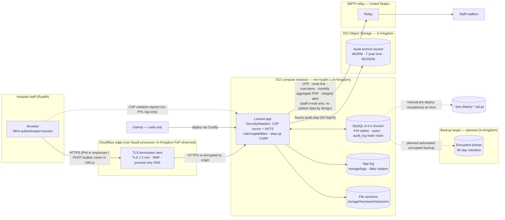

# Data Protection Impact Assessment (DPIA) — DMC Internal Medicine patient-flow hub

> **Confirmed inputs (2026-09-03) — see [`CONFIRMED-FACTS.md`](CONFIRMED-FACTS.md).** Controller: **Dammam Medical Complex**, under the **Eastern Health Cluster** (Saudi Health Holding Company); public-sector ownership, exact registering entity for counsel to confirm. Primary processor: **the developer/operator company** (holds the code, the OCI tenancy and the domain) — **no controller–processor contract exists yet (top action)**. DPO **not yet appointed** (treated as mandatory). The daily production system is still the **legacy PHP app on `dmc-im.com` (SiteGround, United States), original un-hardened build**; the Laravel app runs in parallel until cutover. Review: annual (next 2027-09-03), owner interim until a DPO is named. Legal citations are **[PROPOSED]** — see [`PROPOSED-CITATIONS.md`](PROPOSED-CITATIONS.md).

> **DRAFT — for review by the hospital's legal / data-protection officer and clinical governance; not legal advice.**
>
> Version 0.1 · 2026-09-03 · Assessed system: `laravel/` on `main`, deployed on one OCI instance in me-riyadh-1.
> Assessment owner: [PLACEHOLDER — DPO]. Technical contributor: [PLACEHOLDER]. Clinical contributor: [PLACEHOLDER].

---

## 1. Why this assessment exists

The hub processes **health data of in-patients** — diagnoses, outcomes including death,
resuscitation status, free-text clinical narratives — together with staff identity data. Health
data is a sensitive category under the Kingdom's Personal Data Protection Law, and the Implementing
Regulations require the controller to assess the privacy impact of processing that involves
sensitive data, new technology, or a likely high risk to data subjects
[VERIFY ARTICLE — the impact-assessment duty and its triggers; whether prior consultation with the
competent authority is required when residual risk stays high].

This document records that assessment. It is written against the system **as it is**, using
[`ROPA.md`](ROPA.md) as the inventory, [`../DATABASE-AND-BEHAVIOR.md`](../DATABASE-AND-BEHAVIOR.md)
and [`../HANDOVER-COMPLIANCE.md`](../HANDOVER-COMPLIANCE.md) as the behavioural ground truth, and
[`../DEPLOY-LARAVEL.md`](../DEPLOY-LARAVEL.md) for the operating environment. Where a control is
"planned" it is labelled **GAP** and given an owner and a date placeholder.

---

## 2. Description of the processing

### 2.1 Nature

A web application (Laravel 13, Inertia/Vue 3, MySQL 8.4) used by the Internal Medicine unit to:
admit and track patients through ward/ICU/discharge (A1 in the ROPA), keep a ledger of specialist
consultations (A2), write and acknowledge handover notes (A3), produce dashboards, statistics,
exports and a monthly PDF (A4), manage staff accounts with mandatory MFA (A5), maintain a
tamper-evident audit log shipped off-box (A6), back up the database (A7 — being built), and send
transactional e-mail (A8).

### 2.2 Scope (volumes, from the live database)

| Population | Approximate size |
|---|---|
| Distinct patients (`patients`) | 17,400 |
| Admission episodes (`admissions`) | 37,700 |
| Consultations | 1,300 (≈1,283 historical rows at the ledger migration) |
| Staff accounts (`users`) | 331 (≈150 active) |
| Handover revisions, follow-ups, signatures, notifications | Growing daily; append-only |

### 2.3 Context

- The hub is a **secondary** clinical system: it does not replace the hospital's primary record
  system [VERIFY name and whether the hub is formally part of the medical record].
- Users are hospital employees on the unit; the Observer role exists for read-only viewers.
- Patients are not users of the system and are not currently informed of it by a system-specific
  notice (privacy notice is a separate workstream).
- The application replaced a legacy PHP system that had no authentication on most endpoints; the
  legacy data (and its exposure history) were imported.

### 2.4 Purposes

Operational patient-flow management; continuity of care at handover; specialist-referral
bookkeeping; service statistics and management reporting; staff authentication; accountability.

### 2.5 Data flows

Points to note on the diagram:

1. **Cloudflare sees clear-text PHI.** TLS terminates at the Cloudflare edge and is re-established
   to the origin. Cloudflare is a non-Saudi legal entity even though the serving PoP has been
   observed inside the Kingdom. Whether this is a "transfer outside the Kingdom" or processing by a
   foreign processor with in-Kingdom infrastructure is a legal question [VERIFY ARTICLE — transfer
   definition; Cloudflare's regional-services / data-localisation options].
2. **The e-mail path leaves the Kingdom** but carries only staff personal data and aggregate
   reports by design. The premise that the monthly PDF is aggregate-only must be confirmed by
   inspecting a generated sample [VERIFY].
3. **Audit shipping stays in-Kingdom** and lands on immutable storage.
4. **No automated backup path exists yet** (dotted). The only copies today are manual host-local
   dumps taken before deploys.

---

## 3. Necessity and proportionality

| Question | Assessment | Action |
|---|---|---|
| Is each data element necessary for the purpose? | Demographics are minimal (age, not date of birth; nationality as a country name). Diagnoses (ICD-10) are needed for TB classification, LOS and case-mix. Free-text fields (`handovers.body`, `consultations.response_note`, `consultation_followups.note`) are open-ended by nature. | Clinical guidance on what belongs in free text, and what should stay in the primary record [PLACEHOLDER — governance instruction]. Confirm `nationality` is still needed for reporting [VERIFY]. |
| Purpose limitation | Purposes are operational and internal; statistics are a compatible further use [VERIFY]. No marketing, profiling or automated decision-making about patients. The shuffle auto-assigns *consultants* (workload balancing), not patients' care. | Record the auto-assignment as staff workload processing in the ROPA (done, A1). |
| Accuracy | Attribution is session-sourced; multi-row writes are transactional; data-quality digest runs daily. **Worked example of an accuracy failure — the UTC-vs-Riyadh day bug (§5, R2).** | Keep `app_timezone` set to the hospital's zone at runtime; keep the DB container's zone aligned [VERIFY]. |
| Storage limitation | No retention period is defined for clinical rows; nothing is ever purged. | DATA-RETENTION.md; legal confirmation of the clinical period [NEEDS LEGAL CONFIRMATION]. |
| Transparency | No patient-facing notice for this system; staff are informed by [PLACEHOLDER — HR/IT policy]. | Privacy-notice workstream [PLACEHOLDER]. |
| Data-subject rights | Fulfilled indirectly via the medical-records office. | Procedure [PLACEHOLDER]. |
| Processors | OCI, Cloudflare, SMTP relay; no DPAs on file within this repository. | DPA workstream [PLACEHOLDER — owner/date]. |
| International transfers | Cloudflare edge; US SMTP relay. | Legal analysis + safeguards [VERIFY]. |
| Less intrusive alternatives considered | Aggregate-only e-mails; PHI-free URLs; break-glass logging available; Observer role read-only. | Consider an in-Kingdom relay and Cloudflare regional services (§7). |

---

## 4. Risk-scoring method

Likelihood (L) and severity to data subjects (S) are each scored one to five; the score is L × S.

| L | Meaning | S | Meaning for the data subject |
|---|---|---|---|
| 1 | Remote — would require several independent failures | 1 | Negligible — no real effect |
| 2 | Unlikely — a determined insider or a rare fault | 2 | Minor — inconvenience, easily reversed |
| 3 | Possible — plausible within a year | 3 | Moderate — distress, some loss of control, recoverable |
| 4 | Likely — expected within a year without further action | 4 | Major — discrimination, stigma (e.g. TB, DNR status), lasting loss of control |
| 5 | Almost certain / already happening | 5 | Severe — physical harm from wrong clinical information, or mass exposure |

Bands: **Low** 1–5 · **Medium** 6–11 · **High** 12–19 · **Critical** 20–25. Residual risk at
High or Critical after planned measures triggers escalation to the DPO and consideration of prior
consultation with the competent authority [VERIFY].

---

## 5. Risk register

Each entry gives the inherent score (no controls), the controls that exist in code today, the
residual score with those controls, and the planned measures with owner and date placeholders.

### R1 — Confidentiality breach by an external attacker

| | |
|---|---|
| **Scenario** | Exploitation of the web application, the host, or a stolen credential leads to bulk read of `patients`, `admissions`, `admission_diagnoses`, `handovers`, `consultations`. Roughly 17,400 people's diagnoses and outcomes. |
| **Inherent** | L4 × S5 = **20 Critical** (the predecessor system was reachable unauthenticated; the data has already been exposed once). |
| **Existing controls** | Mandatory TOTP MFA for every user (`EnsureMfaEnrolled`); phased registration with e-mail and authenticator proof before an account exists; admin activation of new accounts; IP-keyed login/MFA throttling; failed-login burst alert to admins; server-side role/capability checks on every endpoint; step-up re-auth on destructive/config actions; CSRF; CSP with per-request nonce + HSTS (`SecurityHeaders`); TLS 1.2 minimum at the edge; origin reachable only through Cloudflare [VERIFY]; PHI never in URLs (no leakage via logs/referrers); session idle timeout thirty minutes and lifetime two hours; secrets (`mfa_secret`, `mail_password`) encrypted with `APP_KEY`; single-instance, single-region footprint. |
| **Residual** | L2 × S5 = **10 Medium**. Severity cannot be reduced by controls; likelihood is. |
| **Planned** | Encryption of PHI at rest (planned) — reduces impact of volume/backup theft, not of application-layer compromise; periodic external penetration test [PLACEHOLDER — owner, date]; vulnerability management for Composer/npm dependencies [PLACEHOLDER]; WAF rules tuned [PLACEHOLDER]. |

### R2 — Integrity / accuracy: wrong clinical facts recorded (worked example: the UTC-vs-Riyadh day bug)

| | |
|---|---|
| **Scenario** | A systematic fault causes records to state something false about a patient. **Worked example — just fixed:** `config/app.php` defaults the application timezone to UTC when `APP_TIMEZONE` is not set. The live instance ran on UTC while the unit works in Riyadh time (three hours ahead). Every date-only column stamped with "today" — `admissions.admit_date`, `medical_discharge_date`, `discharge_date`, `assigned_on`, `consultations.signoff_date`, `consultation_followups.followup_date`, and the `handovers.updated_at` same-day gate — was written with the *previous* calendar day for actions taken between midnight and three in the morning Riyadh time. Consequences: a discharge recorded on the wrong day (length-of-stay off by one), "discharged today" and readmission-window metrics mis-counted, a handover written after midnight not counting as "refreshed today" so an unnecessary incomplete-handover reminder was raised, and follow-up ticks landing on the wrong day. A related code defect had the consultation-dashboard ageing computed from the database host's clock rather than the application's day (fixed in commit `f0b2962`, "dashboard ageing uses the app's day, not the DB host's"). The runtime fix is to set the timezone in Control → System (`RuntimeConfigServiceProvider` applies `settings.app_timezone` to `config('app.timezone')` and `date_default_timezone_set` on boot) or `APP_TIMEZONE` in `.env`, and to align the MySQL container's zone [VERIFY the exact production change and date; VERIFY whether historical rows in the affected window were corrected]. |
| **Inherent** | L5 × S3 = **15 High** (it was actually happening). |
| **Existing controls** | Runtime timezone override with in-app history (`setting_changes`); DEPLOY-LARAVEL.md §2 warning; daily data-quality digest (`dq:notify`); check constraints on inverted dates (`2026_06_14_010006`); transactional multi-row writes; session-sourced attribution (no spoofed actors); append-only revisions so corrections never destroy history; reverse-discharge / reverse-sign-off limited to same-day and audited. |
| **Residual** | L2 × S3 = **6 Medium**. |
| **Planned** | Add a startup/health assertion that the effective timezone equals the configured hospital zone and that `NOW()` in MySQL agrees with PHP within a tolerance [PLACEHOLDER — owner, date]; include "date-of-record vs date-of-entry" in clinical-audit spot checks [PLACEHOLDER]; the `/health` endpoint once shipped should surface this. |

### R3 — Availability and loss: no automated backup

| | |
|---|---|
| **Scenario** | Disk failure, ransomware, a destructive migration, or an operator error on the single instance destroys the database. The only copies are manual pre-deploy `mysqldump` files in the operator's home directory on the *same host*. The unit loses its live census and 37,700 historical episodes; care coordination reverts to paper. |
| **Inherent** | L3 × S4 = **12 High** (single instance, no automation). |
| **Existing controls** | Manual dump before every deploy and before `legacy:import` (DEPLOY-LARAVEL.md §3, §7); maintenance mode during deploys; migrations are additive and reversible; the audit log has an off-box immutable copy (so accountability survives even if data does not); soft deletes make most "deletions" reversible; the legacy application remains deployable as a fallback (DEPLOY-LARAVEL.md → Rollback). |
| **Residual (today)** | L3 × S4 = **12 High** — unchanged until the backup ships. |
| **Planned** | Automated, encrypted, off-box backups with ninety-day retention and a tested restore (**being built** — owner [PLACEHOLDER], date [PLACEHOLDER]); backup-stale notification; documented restore drill twice a year (INCIDENT-RESPONSE.md §11). Expected residual after: L1 × S4 = 4 Low. |

### R4 — Unauthorised access via a legitimate account

| | |
|---|---|
| **Scenario** | Credential phishing, a shared workstation left logged in, a trusted-device cookie on a lost laptop, or an over-privileged role lets someone read or change records they should not. |
| **Inherent** | L4 × S4 = **16 High**. |
| **Existing controls** | MFA cannot be self-disabled; recovery codes hashed; trusted-device skip is a fixed, non-extending window (default twenty-four hours, admin-tunable, revocable, audited as `mfa.device_trusted` / `mfa.device_revoked`); idle timeout thirty minutes, absolute timeout configurable; password expiry three months; remember-me never granted to MFA users; capability flags per user; primary-consultant ownership checks; admin-only registry/exports; every action audited with IP; failed-login burst alert. |
| **Residual** | L2 × S4 = **8 Medium**. |
| **Planned** | Quarterly access review of roles and capability flags in Control → Users [PLACEHOLDER]; decide whether `mfa_trusted_device_hours` should be shortened or zeroed on shared workstations [PLACEHOLDER — governance]; enable `log_record_opens` by default or for defined sensitive episodes [PLACEHOLDER]. |

### R5 — Cross-border exposure at the Cloudflare edge

| | |
|---|---|
| **Scenario** | Cloudflare terminates TLS; the edge handles every PHI-bearing response and POST in clear text. A lawful-access request in a foreign jurisdiction, a Cloudflare-side incident, or routing to a PoP outside the Kingdom would expose PHI to a non-Saudi processor or territory. |
| **Inherent** | L2 × S4 = **8 Medium**. |
| **Existing controls** | In-Kingdom PoP observed; TLS 1.2 minimum, HSTS; PHI-free URLs (edge logs cannot leak identifiers via paths); Cloudflare-only origin firewall. |
| **Residual** | L2 × S4 = **8 Medium** — unchanged by technical controls alone. |
| **Planned** | Legal determination whether this constitutes a transfer and what safeguard applies (DPA, regional-services / data-localisation configuration, or removing Cloudflare from the PHI path by terminating TLS at the origin behind an OCI load balancer) [VERIFY; owner PLACEHOLDER; date PLACEHOLDER]. |

### R6 — Insider misuse (browsing, exporting, altering)

| | |
|---|---|
| **Scenario** | A staff member looks up a patient they are not treating (a colleague, a public figure), exports the registry to a spreadsheet, or edits a record to hide an error. |
| **Inherent** | L4 × S4 = **16 High** (common in health settings). |
| **Existing controls** | Registry and every export are Admin-only; `registry.search` is always audited (redacted filters), `registry.export` / `registry.export_xlsx` audited with row count; optional per-record open logging (`registry.open`, `handover.read` with MRN); every modification audited with before/after; handover revisions append-only; audit rows cannot be edited or deleted through the ORM and are hash-chained, verified nightly, shipped hourly to WORM storage; hard delete of an admission requires Admin + step-up and is audited. |
| **Residual** | L3 × S3 = **9 Medium**. |
| **Planned** | Turn `log_record_opens` ON [PLACEHOLDER — decision]; audit the statistics and audit-log exports too (currently not audited — **GAP**) [PLACEHOLDER — engineering]; periodic review of `registry.export` rows by the DPO [PLACEHOLDER]; staff confidentiality undertaking and training [PLACEHOLDER — HR]. |

### R7 — E-mail path exposure (US-hosted relay)

| | |
|---|---|
| **Scenario** | The relay provider, or an interception between the app and the relay, exposes staff e-mail addresses, usernames, one-time codes, reset links, or the monthly PDF; a mis-addressed `report_recipients` entry sends the PDF to the wrong person. |
| **Inherent** | L3 × S2 = **6 Medium** (staff data and aggregates only). |
| **Existing controls** | No patient data in any mail by design; codes expire and are single-use; reset tokens hashed; relay credential encrypted at rest; `report_recipient.add`/`remove` audited; integrity alert mail is best-effort and PHI-free. |
| **Residual** | L2 × S2 = **4 Low**. |
| **Planned** | Confirm the PDF contains no row-level data [VERIFY]; relay DPA and transfer safeguard [VERIFY]; consider an in-Kingdom relay [PLACEHOLDER]. |

### R8 — Audit-trail tampering or loss of evidence

| | |
|---|---|
| **Scenario** | An attacker or insider with database access edits or deletes audit rows to cover activity; or a restore from an old dump silently drops recent audit rows. |
| **Inherent** | L3 × S3 = **9 Medium**. |
| **Existing controls** | SHA-256 hash chain per row; nightly `audit:verify-daily` with `Log::critical` + in-app admin notification + e-mail; hourly shipping to a WORM bucket with a seven-year lock; `audit:prune` cannot delete unshipped rows and is never scheduled. |
| **Residual** | L1 × S3 = **3 Low**. |
| **Planned** | Backfill pre-chain rows so the whole history verifies [VERIFY done]; after any database restore, reconcile the local table against the WORM copy and reset the shipping high-water mark (INCIDENT-RESPONSE.md §10.3) [PLACEHOLDER — add to restore runbook]. |

### R9 — Supply-chain and code-path risk

| | |
|---|---|
| **Scenario** | A malicious or vulnerable Composer/npm dependency, a compromised GitHub account, or a deploy of unreviewed code exfiltrates data. Legacy history contained real credentials and a PHI dump. |
| **Inherent** | L2 × S4 = **8 Medium**. |
| **Existing controls** | CI on `main` (tests, build reproducibility — DEPLOY-LARAVEL.md → CI); committed lockfiles; private repository; credentials rotated after exposure; `public/build` reproducibility check. |
| **Residual** | L2 × S3 = **6 Medium**. |
| **Planned** | Branch protection and required reviews [PLACEHOLDER]; dependency vulnerability scanning [PLACEHOLDER]; confirm PHI dump purged from history [VERIFY]; GitHub MFA enforced for all collaborators [VERIFY]. |

### R10 — Host compromise / ransomware on the single instance

| | |
|---|---|
| **Scenario** | The OCI instance is compromised (SSH key theft, unpatched kernel — a reboot has reportedly been pending for weeks [VERIFY]). Attacker gains `.env` (DB credentials, `APP_KEY` which decrypts `mfa_secret` and `mail_password`, `AUDIT_S3_*` keys) and the Docker MySQL volume. |
| **Inherent** | L3 × S5 = **15 High**. |
| **Existing controls** | SSH key auth [VERIFY]; Cloudflare-only ingress; audit copy on WORM storage (attacker cannot alter or delete the archive even with the keys, subject to the retention lock [VERIFY lock mode]); manual dumps (also on the host — not a protection here). |
| **Residual** | L3 × S5 = **15 High** until backups and at-rest encryption land. |
| **Planned** | Off-box encrypted backups (being built); PHI encryption at rest (planned); patch/reboot cadence [PLACEHOLDER]; OCI security list restricting SSH to admin IPs [PLACEHOLDER]; key rotation procedure (INCIDENT-RESPONSE.md §7). Expected residual after: L2 × S5 = 10 Medium. |

### R11 — Over-retention / unlawful retention

| | |
|---|---|
| **Scenario** | Records are kept beyond the period the purpose or the law allows because nothing is ever purged; departed staff accounts and stale device-trust rows accumulate. |
| **Inherent** | L5 × S2 = **10 Medium** (certain to occur; harm is diffuse). |
| **Existing controls** | Audit retention setting + prune tool; soft deletes; deactivation of accounts. |
| **Residual** | L4 × S2 = **8 Medium**. |
| **Planned** | DATA-RETENTION.md schedule; legal confirmation of the clinical period [NEEDS LEGAL CONFIRMATION]; scheduled dry-run of `audit:prune`; sweeps for `pending_registrations`, `trusted_devices`, `password_reset_tokens` [PLACEHOLDER — engineering]. |

### R12 — Patient identifiers leaking into secondary stores

| | |
|---|---|
| **Scenario** | Identifiers propagate into places with weaker handling: `notifications.payload` (patient name + MRN for `handover.incomplete`), `audit_log.details` (MRN on `handover.read`; names on `patient.modify`), application-log exception context, printed handover sheets, spreadsheets on staff devices. |
| **Inherent** | L4 × S3 = **12 High**. |
| **Existing controls** | URLs PHI-free (so web/CDN/CSP logs are clean); CSP reports carry no PHI; `redactedFilters` on registry search audit; log level `warning` in production (DEPLOY-LARAVEL.md §2); exports audited. |
| **Residual** | L3 × S3 = **9 Medium**. |
| **Planned** | Classification and handling rules for each store (DATA-CLASSIFICATION.md); log-scrubbing review [PLACEHOLDER]; printed-sheet handling rule [PLACEHOLDER — clinical governance]. |

---

## 6. Residual-risk summary

| Risk | Inherent | Residual today | Band | After planned measures |
|---|---|---|---|---|
| R1 External confidentiality breach | 20 | 10 | Medium | 10 |
| R2 Integrity / accuracy (timezone example) | 15 | 6 | Medium | 4 |
| R3 Availability / no backup | 12 | **12** | **High** | 4 |
| R4 Unauthorised access via account | 16 | 8 | Medium | 6 |
| R5 Cloudflare edge exposure | 8 | 8 | Medium | depends on legal finding |
| R6 Insider misuse | 16 | 9 | Medium | 6 |
| R7 E-mail path | 6 | 4 | Low | 4 |
| R8 Audit tampering | 9 | 3 | Low | 3 |
| R9 Supply chain | 8 | 6 | Medium | 4 |
| R10 Host compromise | 15 | **15** | **High** | 10 |
| R11 Over-retention | 10 | 8 | Medium | 4 |
| R12 Identifier leakage to secondary stores | 12 | 9 | Medium | 6 |

Two risks remain **High** today (R3, R10). Both are driven by the same two gaps — no automated
off-box backup and no encryption of PHI at rest — which are already in flight. The DPO should
decide whether their interim status requires consultation with the competent authority [VERIFY].

---

## 7. Action plan

| # | Measure | Addresses | Owner | Target date | Status |
|---|---|---|---|---|---|
| 1 | Automated encrypted off-box backups, ninety-day retention, tested restore, stale-backup alert | R3, R10 | [PLACEHOLDER] | [PLACEHOLDER] | Being built |
| 2 | Encryption of PHI at rest (approach to be chosen: volume-level with customer-managed keys vs column-level) | R1, R10 | [PLACEHOLDER] | [PLACEHOLDER] | Planned |
| 3 | Incident-response runbook adopted and exercised | all | [PLACEHOLDER] | [PLACEHOLDER] | Drafted — INCIDENT-RESPONSE.md |
| 4 | Privacy notice, DPO appointment, processor DPAs (OCI, Cloudflare, SMTP relay) | R5, R7, transparency | [PLACEHOLDER] | [PLACEHOLDER] | Other workstream |
| 5 | Legal finding on Cloudflare edge as a transfer; configure regional services or re-architect | R5 | [PLACEHOLDER — legal] | [PLACEHOLDER] | Open |
| 6 | Confirm clinical retention period; implement retention schedule | R11 | [PLACEHOLDER — legal + engineering] | [PLACEHOLDER] | Open [NEEDS LEGAL CONFIRMATION] |
| 7 | Schedule `audit:prune` dry-run; backfill pre-chain hashes; restore-reconciliation step | R8, R11 | [PLACEHOLDER] | [PLACEHOLDER] | Open |
| 8 | Audit the statistics and audit-log exports; decide default for `log_record_opens` | R6, R12 | [PLACEHOLDER] | [PLACEHOLDER] | Open |
| 9 | Timezone/clock assertion in `/health`; align MySQL container zone | R2 | [PLACEHOLDER] | [PLACEHOLDER] | Open |
| 10 | Quarterly access review; staff confidentiality training | R4, R6 | [PLACEHOLDER — HR/clinical governance] | [PLACEHOLDER] | Open |
| 11 | Patch/reboot cadence; SSH source restriction; GitHub branch protection + MFA | R9, R10 | [PLACEHOLDER] | [PLACEHOLDER] | Open |
| 12 | Sweeps for expired `pending_registrations`, `trusted_devices`, `password_reset_tokens` | R11 | [PLACEHOLDER] | [PLACEHOLDER] | Open |

---

## 8. Consultation

| Party | Consulted? | Date | Summary |
|---|---|---|---|
| DPO / legal | [PLACEHOLDER] | [PLACEHOLDER] | |
| Clinical governance (Head of IM) | [PLACEHOLDER] | [PLACEHOLDER] | |
| IT / information security | [PLACEHOLDER] | [PLACEHOLDER] | |
| Staff representatives (as users) | [PLACEHOLDER] | [PLACEHOLDER] | |
| Patients / patient-experience office | [PLACEHOLDER] | [PLACEHOLDER] | Whether a patient view is needed given the secondary nature of the system |
| Competent authority (prior consultation) | [VERIFY whether required] | | |

---

## 9. Sign-off

| Role | Name | Decision (accept residual risk / accept with conditions / reject) | Signature | Date |
|---|---|---|---|---|
| Data Protection Officer | [PLACEHOLDER] | | | |
| Clinical owner | [PLACEHOLDER] | | | |
| System owner | [PLACEHOLDER] | | | |
| Information-security lead | [PLACEHOLDER] | | | |
| Executive sponsor | [PLACEHOLDER] | | | |

Conditions attached to acceptance (if any): [PLACEHOLDER]

---

## 10. Review

This DPIA is to be reviewed: on completion of action-plan items 1, 2 and 5; on any new processing
activity or processor; after any SEV1/SEV2 incident (INCIDENT-RESPONSE.md); and at least
annually [VERIFY any mandated review frequency]. Next review: [PLACEHOLDER].
