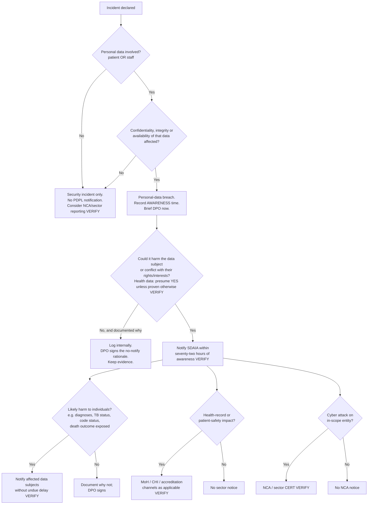

# Incident-response and personal-data-breach runbook — DMC Internal Medicine patient-flow hub

> **DRAFT — for review by the hospital's legal / data-protection officer and clinical governance; not legal advice.**
>
> Version 0.1 · 2026-09-03 · Applies to the Laravel application on the OCI instance (me-riyadh-1), its MySQL container, the Cloudflare zone, the SMTP relay, the audit archive bucket and the GitHub repository.
> Runbook owner: [PLACEHOLDER — Information-security lead]. Exercise this at least twice a year (§12).

**Print this page and keep a copy off the system.** If the host is down or compromised you will not be able to read it there.

---

## 1. Scope and principles

- An **incident** is any event that threatens the confidentiality, integrity or availability of the hub's data or service.
- A **personal-data breach** is an incident that leads, or may lead, to accidental or unlawful destruction, loss, alteration, unauthorised disclosure of, or access to personal data — including staff data, not only patient data [VERIFY — definition in the law / Implementing Regulations].
- Principles: **contain first, preserve evidence second, communicate third, fix fourth**; never destroy evidence to restore service without the incident lead's explicit decision; blameless — the purpose of the postmortem is to fix systems, not people.
- Detection sources, containment steps and evidence locations below are limited to what **actually exists** in this system. Items marked *(once shipped)* do not exist yet.

---

## 2. Severity matrix

| Severity | Definition | Examples specific to this system | Response target | Who is paged |
|---|---|---|---|---|
| **SEV1 — Critical** | Confirmed or highly likely exposure of patient data, or loss of the service with no path to recovery, or evidence integrity destroyed | Bulk PHI exfiltration (e.g. `registry.export` rows by a compromised admin, database dump found outside the host); ransomware / host loss with **no restorable backup**; authentication bypass allowing any user to act as another; `audit:verify-daily` **CRITICAL** with rows provably altered; `.env` / `APP_KEY` / DB credentials leaked publicly | Lead on the call within fifteen minutes, around the clock; regulator clock starts (§9) | Incident lead, technical lead, DPO/legal, executive sponsor, clinical owner |
| **SEV2 — High** | Likely limited exposure, or major degradation, or a control failure that could become SEV1 | Single-record or single-user inappropriate access (insider browsing detected via `registry.open` / `handover.read`); a trusted-device cookie on a lost device; audit chain break with unknown cause; outage longer than **four hours** during clinical hours; a staff account confirmed phished (`login.success` from an unexpected IP after a failed-login burst); a lost printed handover sheet | Lead within one hour | Incident lead, technical lead, DPO informed |
| **SEV3 — Medium** | No exposure believed; security or integrity weakness needing prompt action | Failed-login burst notification (`security.failed_logins`) with no success; CSP violation storm indicating injected content attempts; the timezone/day-boundary class of accuracy defect; backup-stale alert *(once shipped)*; expired TLS or HSTS misconfiguration | Next business day | Technical lead |
| **SEV4 — Low** | Housekeeping, near misses, policy questions | A staff member e-mails an aggregate PDF to the wrong internal recipient; `audit:ship` failing because `AUDIT_S3_*` keys expired (rows remain local and unshipped — not lost) | Within a week | Technical lead |

Escalate whenever new facts increase the likely impact. Downgrade only with the incident lead's written note in the incident log.

---

## 3. Roles

| Role | Holder (primary / deputy) | Contact | Responsibilities |
|---|---|---|---|
| **Incident lead** | [PLACEHOLDER] / [PLACEHOLDER] | [PLACEHOLDER] | Declares severity, owns decisions, keeps the incident log, runs the postmortem |
| **Technical lead** | [PLACEHOLDER] / [PLACEHOLDER] | [PLACEHOLDER] | Executes containment and recovery (§7, §10); has SSH to the host, Coolify admin, OCI console, Cloudflare zone admin |
| **Communications** | [PLACEHOLDER] | [PLACEHOLDER] | Internal updates, staff notices, patient notices, media (§9.5) |
| **DPO / legal** | [PLACEHOLDER] | [PLACEHOLDER] | Breach determination, regulator and data-subject notifications (§9), legal hold |
| **Clinical owner** | [PLACEHOLDER — Head of IM] | [PLACEHOLDER] | Clinical-safety decisions (paper fallback, record correction), clinical-governance reporting |
| **Executive sponsor** | [PLACEHOLDER] | [PLACEHOLDER] | Approves external notifications and major service decisions |
| **Scribe** | Anyone the lead appoints | | Timestamps every action in the incident log (§6.4) |

Contact tree and out-of-hours numbers: Appendix A.

---

## 4. Detection sources

### 4.1 Existing today

| Source | What it signals | Where it surfaces | Reference |
|---|---|---|---|
| `audit:verify-daily` (02:30 daily) | Audit hash chain broken → possible tampering or deletion | `Log::critical('audit.integrity_failure')` in `storage/logs`; in-app `audit.integrity_failure` notification to every **active admin** (bell), de-duplicated while unresolved; plain-text e-mail to active `report_recipients` (best-effort) | [`../../app/Console/Commands/AuditVerifyDaily.php`](../../app/Console/Commands/AuditVerifyDaily.php), [`../../routes/console.php`](../../routes/console.php) |
| Failed-login burst | Count of `login.failed` audit rows for one username in the last ten minutes reaches `settings.failed_login_notify_threshold` (default five; zero disables) | In-app `security.failed_logins` notification to every active admin | `AuthController` (Phase 4 item 3) |
| CSP report sink | Browser-reported policy violations (injected scripts, unexpected resource loads) | `Log::warning('CSP violation reported', …)` in `storage/logs` — log-only, no storage, no PHI | `CspReportController`, `SecurityHeaders` |
| `audit:ship` failure | Archive unreachable / rejected → `Log::error('audit.ship_failed')`; unshipped rows accumulate locally | `storage/logs` | `AuditShip.php` |
| Data-quality digest (07:00) | Anomalous or inconsistent records (accuracy incidents) | In-app notification to admins | `dq:notify` |
| Audit viewer `/audit` | Manual review of `registry.search`, `registry.export*`, `registry.open`, `handover.read`, `admission.delete`, `user.update`, `login.*`, `session.timeout`, `stepup.verified`, `settings.system.update` | Admin UI + CSV/XLSX export | `AuditController` |
| Cloudflare dashboard | Traffic spikes, WAF events, origin errors | Cloudflare zone analytics / security events [VERIFY plan features] | — |
| OCI console | Instance health, volume state, unexpected API activity | OCI Monitoring / Audit service [VERIFY enabled] | — |
| People | Staff reporting odd behaviour, a lost device, a mis-sent e-mail | [PLACEHOLDER — reporting channel] | — |

### 4.2 Not yet available *(once shipped)*

| Source | Status |
|---|---|
| `/health` endpoint (app + DB + clock/timezone assertion) | Not implemented — there is no `health` route in `routes/web.php` |
| Backup-stale notification | Depends on the backup workstream |
| Error tracking (Sentry) | Optional per DEPLOY-LARAVEL.md §2; [VERIFY whether a DSN is configured in production] |
| Off-box shipping of application logs | Not implemented (only audit rows ship) |

---

## 5. Declare and classify

1. Whoever notices: report to the technical lead **immediately** by [PLACEHOLDER — phone/chat]. Do not investigate on your own beyond confirming what you saw.
2. Technical lead: confirm the signal is real (rule out a known cause — e.g. a deploy, a test account). Time-box this to **fifteen minutes**.
3. Technical lead + incident lead: assign a severity from §2, open the incident log (§6.4), and page per §2.
4. If **any** personal data may have been exposed, altered or lost: inform the DPO now, not after containment. The regulatory clock (§9) runs from **awareness**, not from confirmation [VERIFY the exact trigger].

---

## 6. First-hour checklist

Tick each item in the incident log with a timestamp and the name of who did it.

- [ ] **T+0** Severity declared; incident lead named; log opened; scribe appointed.
- [ ] **T+5** Decide *contain vs observe*. Default for SEV1/SEV2: contain.
- [ ] **T+10** **Snapshot before you change anything** (§8.1): OCI boot + block volume backup; copy `storage/logs`; export the audit log.
- [ ] **T+15** Containment actions started (§7) appropriate to the scenario.
- [ ] **T+20** DPO/legal briefed with: what data, how many subjects, how it happened (best guess), whether ongoing.
- [ ] **T+30** Clinical owner briefed; decide whether the unit needs a paper fallback (§10.1).
- [ ] **T+45** Internal holding statement to staff (§9.5) if service is affected or credentials must be changed.
- [ ] **T+60** First written status update; next update time set (every hour for SEV1, every four hours for SEV2).
- [ ] Legal hold applied: nothing under `storage/`, no DB rows, no OCI snapshots, no mailbox items to be deleted until released by the DPO.

### 6.4 Incident log format

```
[YYYY-MM-DD HH:MM Riyadh] [who] [action | observation | decision] free text
```

Keep it in a place that survives the incident: [PLACEHOLDER — e.g. a shared document outside the OCI tenancy]. Attach command output verbatim.

---

## 7. Containment playbooks (real steps for this stack)

All commands run on the OCI host as the deploy user, inside the app container or working directory as noted. **Take the §8.1 snapshot first.**

### 7.1 Revoke every active session (suspected session hijack, credential leak, or before rotating secrets)

Production uses the **file** session driver [VERIFY `SESSION_DRIVER` in the live `.env`]:

```bash
# inside the app container / working directory
rm -f storage/framework/sessions/*
```

If the driver is `database`, instead: `TRUNCATE TABLE sessions;`. Every user is logged out and must re-authenticate with MFA. Then revoke device trust so the MFA-skip window cannot be reused:

```sql
UPDATE trusted_devices SET revoked_at = NOW() WHERE revoked_at IS NULL;
```

Remember-me tokens are never issued to MFA users; clearing `users.remember_token` is belt-and-braces only.

**Do NOT rotate `APP_KEY` as a reflex.** It encrypts `users.mfa_secret` and `settings.mail_password`; rotating it without re-encrypting those columns locks every user out of MFA and breaks e-mail. Rotate it only under §7.4 with the re-encryption step.

### 7.2 Disable a specific user (phished account, insider, departed staff)

1. Control → Users → open the user → untick **Active** → Save (`PUT /control/users/{id}`, audited as `user.update`). The account can no longer log in; existing sessions end at the next request [VERIFY — confirm `active` is re-checked per request, otherwise also run §7.1].
2. Same page → **Reset MFA** (`user.reset_mfa`) if the authenticator may be in the attacker's hands.
3. Revoke that user's trusted devices: `UPDATE trusted_devices SET revoked_at = NOW() WHERE user_id = <id> AND revoked_at IS NULL;`
4. Pull the user's recent activity: `/audit` filtered by actor, or `SELECT * FROM audit_log WHERE actor_id = <id> AND created_at > '<since>' ORDER BY id;` — pay attention to `registry.search`, `registry.export*`, `registry.open`, `handover.read`, `patient.modify`, `admission.*`.
5. If the account is an **admin**: also check `user.update` rows they wrote (privilege changes to others), `settings.update` / `settings.system.update` (SMTP redirection, timezone), `report_recipient.add` (PDF exfiltration), and `user.send_reset` (takeover of other accounts).

### 7.3 Block or slow the attacker at the edge (Cloudflare)

- **Under Attack Mode**: Cloudflare dashboard → Security → Settings → Security Level → *I'm Under Attack*. Adds a JavaScript challenge to every request; staff can still work.
- **Block by IP / country / ASN**: Security → WAF → Custom rules. Prefer *block* over *challenge* for a known-bad source.
- **Confirm the origin still only accepts Cloudflare**: the OCI security list / NSG must allow HTTPS only from Cloudflare's published ranges [VERIFY the rule set]. If the attacker is hitting the origin IP directly, fix this first.
- Never turn the proxy off ("grey cloud") during an incident — it exposes the origin IP.

### 7.4 Rotate secrets

| Secret | Where it lives | How to rotate | Then |
|---|---|---|---|
| MySQL application user / root | MySQL container environment (Coolify → the database resource → environment variables) and the app's `DB_PASSWORD` | Change the password in MySQL (`ALTER USER … IDENTIFIED BY …`), update both env locations, **redeploy** the app in Coolify so the new value is loaded | Verify `php artisan migrate:status` connects |
| `APP_KEY` | App `.env` / Coolify env | Generate a new key **only** with a re-encryption plan: decrypt `users.mfa_secret` and `settings.mail_password` with the old key and re-encrypt with the new one in one maintenance window [PLACEHOLDER — engineering script]; otherwise reset MFA for all users and re-enter the SMTP password | Announce to all staff that MFA must be re-enrolled if the fallback was used |
| `AUDIT_S3_ACCESS_KEY` / `AUDIT_S3_SECRET` | App env; OCI IAM customer secret keys | Create a new key pair in OCI, update env, redeploy, then delete the old pair | Run `php artisan audit:ship` manually and confirm `shipped N row(s)` |
| SMTP password | Control → System (stored encrypted in `settings.mail_password`) — step-up gated | Rotate at the relay provider, paste the new value in Control → System | Send a test password-reset to yourself |
| SSH keys | `~/.ssh/authorized_keys` on the host | Replace with new keys; remove the compromised one | Confirm login from the admin workstation only |
| Cloudflare API tokens / GitHub tokens | Cloudflare and GitHub dashboards | Revoke and reissue | |

### 7.5 Take the site down or into maintenance

- **Maintenance mode (preferred — keeps the process up, blocks users):**
  `php artisan down --secret="<long-random>"` — operators can still reach the app via `https://<host>/<secret>`. Bring back with `php artisan up`. (DEPLOY-LARAVEL.md §7.)
- **Hard stop (host compromise, ransomware, ongoing exfiltration):** Coolify → the application → **Stop**. If the host itself is untrusted, stop the instance from the OCI console instead, *after* the §8.1 snapshot.
- **Network isolation without stopping (to preserve volatile state):** OCI console → the instance's VNIC → security list / NSG → replace ingress rules with a single rule allowing SSH from the admin IP only.

### 7.6 Audit-chain break (`audit.integrity_failure`)

1. **Do not write to `audit_log` by hand and do not run `audit:prune`.**
2. Localise: `php artisan audit:verify --from=<date> --to=<date>` narrows the first broken row. The message says whether it is a *content hash mismatch* (a row was edited) or a *chain break* (a row was deleted).
3. Rule out benign causes: a database restore from an older dump (§10.3), or a pre-chain unhashed row (`AuditVerify` warns separately — that is not tampering).
4. Compare the suspect id range with the WORM archive: fetch the NDJSON objects under `audit/YYYY/MM/DD/<from>-<to>-<ts>.ndjson` covering those ids and diff field by field. The archive copy is authoritative; it cannot have been altered.
5. Treat any unexplained difference as SEV1 (evidence tampering implies database-level access) and follow §7.1, §7.4.

### 7.7 Suspected PHI exfiltration via export

1. `SELECT * FROM audit_log WHERE action IN ('registry.export','registry.export_xlsx','registry.search','registry.open','handover.read') AND created_at BETWEEN … ORDER BY id;` — `details` gives mode, redacted filters and `row_count`.
2. Note: **statistics exports and the audit-log export are not audited** — check web-server / Cloudflare access logs for `/statistics/export*` and `/audit/export*` hits by the suspect account's IP [VERIFY log availability].
3. Recover the files from the endpoint if possible (staff device) and secure them.

### 7.8 Lost device with a trusted-device cookie or a live session

§7.1 for the user (or globally), then §7.2 step 3. Ask the user to change their password (Profile → Change password, audited as `password.change`).

---

## 8. Evidence preservation

### 8.1 Snapshot first (before any containment that changes state)

| Evidence | How to preserve | Notes |
|---|---|---|
| **Database volume** | OCI console → Block Storage → the volume backing the MySQL container → *Create manual backup* (or *Create clone*); also the boot volume | A volume backup is point-in-time and cannot be altered by the attacker afterwards. Name it `INC-<id>-<timestamp>` and record the OCID in the log. |
| **Logical DB dump** | `mysqldump --single-transaction dmc_laravel | gzip > /secure/INC-<id>-db.sql.gz` to a location **off the host** | Contains PHI — handle as **Secret** (DATA-CLASSIFICATION.md). Record SHA-256 of the file. |
| **Audit log** | `/audit/export-xlsx` (Admin) for the human-readable copy **and** `SELECT … INTO OUTFILE` / `mysqldump audit_log` for the full table incl. `prev_hash`/`row_hash` | The export itself is not audited — write a log line stating who exported it and why. |
| **WORM archive** | Nothing to do — the hourly NDJSON copies in the audit bucket **cannot be altered or deleted** during the retention lock. List the object keys covering the incident window and record them. | This is the copy you cite to the regulator. |
| **Application logs** | `tar czf /secure/INC-<id>-logs.tgz storage/logs/` | Includes CSP reports, `audit.integrity_failure`, `audit.ship_failed`, mail failures. |
| **Session files** | Copy `storage/framework/sessions/` **before** §7.1 clears it | Contains user ids and IPs per session. |
| **Container / host state** | `docker ps -a`, `docker logs <mysql>`, `docker inspect`, `last`, `journalctl --since`, `ss -tunap`, crontab, `.env` (redact secrets when attaching) | Save output to the incident folder. |
| **Cloudflare** | Export security events / analytics for the window [VERIFY plan retention]; note any rule changes with timestamps | |
| **OCI Audit** | Export the tenancy audit events for the window (console / API changes, key creation) [VERIFY enabled] | |
| **E-mail** | Preserve the relay provider's send logs for the window [VERIFY availability]; preserve affected mailboxes | |
| **Physical** | Printed handover / consultation sheets involved — bag, label, store | |

### 8.2 Chain of custody

For each item: what, where stored, hash (SHA-256), who collected, when, who has accessed since. Template in Appendix C. Evidence containing PHI is itself **Secret** and must be stored encrypted with access limited to the incident team and the DPO.

---

## 9. Regulatory and data-subject notification

### 9.1 Who must be told, and when [VERIFY throughout]

| Recipient | Trigger | Deadline (in words) | Channel | Owner |
|---|---|---|---|---|
| **Competent authority — SDAIA** (Saudi Data & AI Authority, the personal-data regulator) | A personal-data breach that harms or may harm the data or the data subject or conflict with their rights/interests | Within **seventy-two hours of becoming aware** of the breach — [VERIFY ARTICLE in the Implementing Regulations, the exact wording of the trigger ("becoming aware" vs "confirming"), whether the period runs in calendar hours, whether phased/partial notification is allowed, and the required content] | The authority's designated portal/form [PLACEHOLDER — URL / reference number procedure] | DPO |
| **Affected data subjects** (patients, staff) | Where the breach may cause harm to the data subject or their interests [VERIFY the harm threshold and any exceptions] | **Without undue delay** [VERIFY exact wording and whether a fixed period applies] | Letter / SMS / phone via the hospital's patient-communication channel [PLACEHOLDER]; staff via HR | DPO + Communications |
| **Ministry of Health** and/or the **Council of Health Insurance** and any health-sector regulator or accreditor the hospital reports to | Health-record incidents, patient-safety impact, or as the hospital's licence/accreditation conditions require [VERIFY applicability, thresholds and channels — e.g. MoH incident reporting, CHI/NPHIES obligations, accreditation body requirements] | Per their rules [VERIFY] | [PLACEHOLDER] | Clinical owner + DPO |
| **National Cybersecurity Authority (NCA)** or sector CERT | Cybersecurity incidents where the hospital is within scope of national cybersecurity controls [VERIFY scope and reporting duty] | [VERIFY] | [PLACEHOLDER] | Information-security lead |
| **Processors** (OCI, Cloudflare, SMTP relay, GitHub) | When their service is involved or their cooperation is needed | Immediately | Support / DPA contacts [PLACEHOLDER] | Technical lead |
| **Cyber-insurance / legal counsel** | Per policy [VERIFY] | Per policy | [PLACEHOLDER] | Executive sponsor |

The seventy-two-hour clock starts on **awareness**. Awareness is when a person with responsibility in the hospital has a reasonable degree of certainty that a breach occurred — not when the postmortem finishes. Record the awareness timestamp explicitly in the incident log.

### 9.2 Decision tree



### 9.3 Notification to the competent authority — template

Use the authority's own form where one exists [PLACEHOLDER]; this template ensures the content is ready. Headings are given in English and Arabic; body text to be completed by the DPO.

```
إخطار بحادثة تسرب بيانات شخصية / Personal-data breach notification
[Reference: INC-<id>]  [Draft / Final]  [Date-time of submission, Riyadh]

1. جهة التحكم ومسؤول حماية البيانات / Controller and Data Protection Officer
   Controller: [PLACEHOLDER legal name, registration, address]
   DPO: [PLACEHOLDER name, e-mail, phone]

2. وقت العلم بالحادثة ووقت وقوعها / Time of awareness and time of occurrence
   Became aware: [YYYY-MM-DD HH:MM Riyadh]   Occurred (best estimate): [...]
   Ongoing? [yes/no]   Reason for any delay beyond the deadline: [...]

3. طبيعة الحادثة / Nature of the breach
   [confidentiality | integrity | availability]  Description of what happened: [...]
   Systems: DMC Internal Medicine patient-flow hub (Laravel/MySQL, OCI me-riyadh-1)

4. فئات البيانات والأشخاص المتأثرين / Categories of data and data subjects affected
   Data subjects: [patients / staff]   Approximate number: [...]
   Data categories: [identifiers (MRN, name) / demographics / diagnoses (ICD-10) / outcomes /
   handover narrative incl. code status / consultation notes / staff credentials / IP addresses]
   Sensitive data involved: [yes/no]

5. الآثار المحتملة / Likely consequences
   [...]

6. الإجراءات المتخذة والمخطط لها / Measures taken and planned
   Containment: [...]   Recovery: [...]   Prevention: [...]

7. إخطار أصحاب البيانات / Notification of data subjects
   [done on … / planned on … / not required because …]

8. معالجون أو جهات خارجية معنية / Processors or third parties involved
   [OCI / Cloudflare / SMTP relay / other]

9. المرفقات / Attachments
   [audit-log extract references, WORM object keys, timeline]
```

### 9.4 Notification to data subjects — template

```
إشعار بحادثة تتعلق ببياناتكم الشخصية / Notice about an incident involving your personal data

ما الذي حدث / What happened: [plain-language, one paragraph]
ما البيانات المعنية / What information was involved: [specific to the person or group]
ما الذي نقوم به / What we are doing: [...]
ما الذي يمكنكم فعله / What you can do: [...]
للتواصل / How to contact us: [PLACEHOLDER — DPO contact, hours, language options]
```

Clinical sensitivity: where diagnoses, TB status, resuscitation status or a death outcome were exposed, the clinical owner reviews the wording and the channel (a letter to a deceased patient's address, for example, must go to the next of kin through the hospital's bereavement process [PLACEHOLDER]).

### 9.5 Internal and public communications

| Audience | When | Owner | Content |
|---|---|---|---|
| All hub users | Any SEV1/SEV2 affecting service or requiring re-authentication | Communications | What is unavailable, what to do instead (paper fallback), when the next update is, whether to change passwords / re-enrol MFA |
| Hospital leadership | SEV1 immediately; SEV2 within four hours | Incident lead | Facts, impact, decisions needed |
| Media / public | Only with executive sponsor + legal approval | Communications | Holding statement [PLACEHOLDER] |

Never confirm or deny specifics to anyone outside the incident team before the DPO has reviewed them.

---

## 10. Recovery

### 10.1 Clinical continuity while the hub is down

- The unit's paper census / whiteboard procedure [PLACEHOLDER — clinical owner to define]; the printed handover sheet from the last good state if available.
- Decide with the clinical owner whether admissions/discharges during the outage will be **back-entered** afterwards (with `admit_date` / `discharge_date` set to the real dates — the audit row will show the later entry time, which is expected).

### 10.2 Restore the service

1. Rebuild on a **clean** host if compromise is suspected (new instance, fresh OS, redeploy from `main` via Coolify). Never reuse a compromised image.
2. Restore the database — in order of preference: the automated encrypted backup *(once shipped)*; the OCI volume backup taken in §8.1 (only if the incident is *not* a compromise of that data); the latest manual `~/pre-deploy-*.sql.gz`; the legacy application as a last resort (DEPLOY-LARAVEL.md → Rollback).
3. Rotate all secrets (§7.4) before the new instance goes live.
4. `php artisan migrate --force` (should report nothing to migrate if the dump matches the code), `config:cache`, `route:cache`, `view:cache`.
5. Confirm Cloudflare points at the new origin and the origin firewall allows only Cloudflare.
6. Run the smoke test in DEPLOY-LARAVEL.md §6.
7. Ask all users to log in again (sessions were cleared) — MFA continues to work only if `APP_KEY` was preserved or the re-encryption step was done.

### 10.3 After a restore: reconcile the audit chain and the shipping mark (known pitfall)

Restoring an older database loses the audit rows written after the dump. Two things then need attention:

1. **Chain:** new rows chain from the last restored row, so `audit:verify` will pass on the local table — but the WORM archive holds rows (with the same ids) that no longer exist locally. Record the gap `[restored MAX(id)+1 … pre-incident MAX(id)]` in the incident log; the archive remains the evidence for that window.
2. **Shipping mark:** `settings.audit_shipped_through_id` is restored to its *old* value, which may be **higher** than the restored table's `MAX(id)`. Because `audit:ship` selects `id > mark`, every new row whose id falls at or below the old mark would **never ship**. Immediately after restore:

```sql
SELECT MAX(id) FROM audit_log;                      -- restored max
SELECT audit_shipped_through_id FROM settings;      -- old mark
-- if mark > restored max: reset the mark so new rows ship again
UPDATE settings SET audit_shipped_through_id = (SELECT MAX(id) FROM audit_log);
```

Then run `php artisan audit:ship` and `php artisan audit:verify` by hand and paste the output into the log. Because the archive will now contain two different rows for some ids (pre-incident and post-restore), the object keys' timestamps disambiguate them — note this in the postmortem so a future auditor is not surprised.

### 10.4 Exit criteria

Service restored and smoke-tested; secrets rotated; attacker access removed and verified (no unexpected `login.success`, no unknown SSH keys, no unknown Cloudflare rules); monitoring back to normal; DPO confirms notifications are complete or scheduled; incident lead closes the incident in the log.

---

## 11. Blameless postmortem

Hold within **five working days** of closure for SEV1/SEV2 (optional for SEV3/4). The facilitator is not the person who ran the incident.

### 11.1 Template

```
# Postmortem — INC-<id> — <one-line title>
Severity: SEV<n>   Declared: <ts>   Contained: <ts>   Resolved: <ts>   Awareness (breach clock): <ts>
Facilitator: [...]   Attendees: [...]

## Summary (three sentences a clinician could read)

## Impact
- Data subjects affected (patients / staff), counts, data categories
- Clinical impact (delays, wrong information, paper fallback duration)
- Service impact (outage duration, degraded functions)
- Regulatory notifications made (who, when, reference numbers)

## Timeline (Riyadh time; from the incident log, not memory)
| Time | Event / action | Source (log line, audit id, WORM key, person) |

## Detection
- What told us (which source in §4)? What should have told us sooner?

## Root cause and contributing factors (technical AND organisational — no names as causes)

## What went well

## What went badly / where we were lucky

## Action items (see 11.2)

## Evidence index (chain-of-custody references)
```

### 11.2 Action-item tracking

| # | Action | Type (prevent / detect / respond / recover) | Owner | Due | Ticket / commit | Status | Verified by |
|---|---|---|---|---|---|---|---|
| 1 | | | [PLACEHOLDER] | [PLACEHOLDER] | | Open | |

Rules: every action has one owner and one date; "verified" means someone other than the owner checked it works (e.g. the new alert fired in a test); items open past their date are reviewed at the monthly security review [PLACEHOLDER — meeting]. Feed relevant items back into [`DPIA.md`](DPIA.md) §7.

---

## 12. Tabletop-exercise schedule

| When | Scenario | Participants | Objective | Evidence of completion |
|---|---|---|---|---|
| [PLACEHOLDER — Q4 2026] | **PHI exfiltration by a compromised admin**: a burst of `login.failed` then `login.success` from a foreign IP, followed by `registry.export_xlsx` with `row_count` 17,000 | Full incident team + DPO | Walk §7.2, §7.7, §8, §9 end-to-end; draft the SDAIA notice within the exercise; measure time-to-awareness | Completed notification draft; timings; action list |
| [PLACEHOLDER — Q1 2027] | **Ransomware / host loss**: the instance is encrypted; latest manual dump is nine days old; automated backup [exists/does not exist] | Technical lead, incident lead, clinical owner | Rebuild on a clean host; restore; §10.3 reconciliation; paper fallback decision; assess data-loss window vs notification duty | Restore timing; RPO/RTO measured; gaps logged |
| [PLACEHOLDER — Q2 2027] | **Audit-chain break at 02:30**: `audit.integrity_failure` fires; cause unknown | Technical lead, DPO | §7.6 localisation; WORM comparison; decide SEV; practise not touching `audit_log` | Written determination; time to classify |
| [PLACEHOLDER — Q3 2027] | **Auth bypass report**: a staff member reports seeing another consultant's inbox | Full team | §7.1 global session revoke; code triage; decide whether it is a breach; data-subject notification decision | Decision record |
| Annually | **Prolonged outage during a clinical day** (Cloudflare or OCI regional event) | Clinical owner, technical lead, communications | Paper fallback, comms cadence, back-entry plan | Runbook updates |
| After every real SEV1/SEV2 | Re-run the relevant scenario within three months to test the action items | | | |

Each exercise ends with a mini-postmortem (§11) and updates to this runbook.

---

## Appendix A — Contact tree

| Role | Name | Mobile | E-mail | Backup |
|---|---|---|---|---|
| Incident lead | [PLACEHOLDER] | | | |
| Technical lead | [PLACEHOLDER] | | | |
| DPO / legal | [PLACEHOLDER] | | | |
| Communications | [PLACEHOLDER] | | | |
| Clinical owner | [PLACEHOLDER] | | | |
| Executive sponsor | [PLACEHOLDER] | | | |
| OCI support | [PLACEHOLDER — tenancy, support tier] | | | |
| Cloudflare support | [PLACEHOLDER — plan, account] | | | |
| SMTP relay support | [PLACEHOLDER] | | | |
| Competent authority (SDAIA) breach portal | [PLACEHOLDER] | | | |
| Sector regulator(s) | [PLACEHOLDER] | | | |

## Appendix B — Quick command reference

```bash
# Where things are (verify paths on the live host)
storage/framework/sessions/     # file sessions — delete to revoke all logins
storage/logs/laravel-*.log      # daily-rotated app log (CSP reports, integrity alerts, ship failures)
.env                            # APP_KEY, DB_*, AUDIT_S3_*  — never copy into chat/e-mail

php artisan down --secret="…" / php artisan up      # maintenance mode
php artisan audit:verify [--from=… --to=…]          # chain check (exit 1 = broken)
php artisan audit:verify-daily                      # chain check + alerts
php artisan audit:ship                              # push unshipped rows now
php artisan audit:prune                             # DRY RUN only — never during an incident
mysqldump --single-transaction dmc_laravel | gzip > INC-<id>-db.sql.gz
```

## Appendix C — Chain-of-custody record

| Item id | Description | Location | SHA-256 | Collected by | Collected at | Access log (who / when / why) |
|---|---|---|---|---|---|---|
| | | | | | | |

## Appendix D — Change log

| Date | Version | Change | Author |
|---|---|---|---|
| 2026-09-03 | 0.1 | Initial draft | [PLACEHOLDER] |
